Alexandros - latin
================

``` r
library(tidyverse)
```

    ## ── Attaching packages ─────────────────────────────────────── tidyverse 1.3.0 ──

    ## ✓ ggplot2 3.3.2     ✓ purrr   0.3.4
    ## ✓ tibble  3.0.4     ✓ dplyr   1.0.2
    ## ✓ tidyr   1.1.2     ✓ stringr 1.4.0
    ## ✓ readr   1.3.1     ✓ forcats 0.5.0

    ## ── Conflicts ────────────────────────────────────────── tidyverse_conflicts() ──
    ## x dplyr::filter() masks stats::filter()
    ## x dplyr::lag()    masks stats::lag()

``` r
library(here)
```

    ## here() starts at /cloud/project

``` r
library(lubridate)
```

    ## 
    ## Attaching package: 'lubridate'

    ## The following objects are masked from 'package:base':
    ## 
    ##     date, intersect, setdiff, union

``` r
spotify_songs <- read_csv(here('data/Spotify.csv'))
```

    ## Parsed with column specification:
    ## cols(
    ##   .default = col_double(),
    ##   track_id = col_character(),
    ##   track_name = col_character(),
    ##   track_artist = col_character(),
    ##   track_album_id = col_character(),
    ##   track_album_name = col_character(),
    ##   track_album_release_date = col_character(),
    ##   playlist_name = col_character(),
    ##   playlist_id = col_character(),
    ##   playlist_genre = col_character(),
    ##   playlist_subgenre = col_character()
    ## )

    ## See spec(...) for full column specifications.

``` r
spotify_songs <- spotify_songs %>%
mutate(popularity_level = case_when(
track_popularity <= 31 ~ "Very Low",
track_popularity > 31 & track_popularity <= 52 ~ "Low",
track_popularity > 52 & track_popularity <= 68 ~ "Fairly High",
track_popularity > 68 & track_popularity <= 100 ~ "High"
)) 
```

``` r
spotify_songs %>%
filter(playlist_genre == "latin") %>%
summarise(min_pop = min(track_popularity), iqr_pop = IQR(track_popularity), med_pop = median(track_popularity), max_pop = max(track_popularity), quantile(track_popularity))
```

    ## # A tibble: 5 x 5
    ##   min_pop iqr_pop med_pop max_pop `quantile(track_popularity)`
    ##     <dbl>   <dbl>   <dbl>   <dbl>                        <dbl>
    ## 1       0      35      50     100                            0
    ## 2       0      35      50     100                           32
    ## 3       0      35      50     100                           50
    ## 4       0      35      50     100                           67
    ## 5       0      35      50     100                          100

\#\#Check popularity of a song with key and mode

``` r
spotify_songs %>%
  filter(playlist_genre == "latin") %>%
  filter(mode == 1) %>%
  group_by(key) %>%
  ggplot(aes(y = track_popularity, x = key)) +
  geom_col() +
  facet_wrap(.~ popularity_level)
```

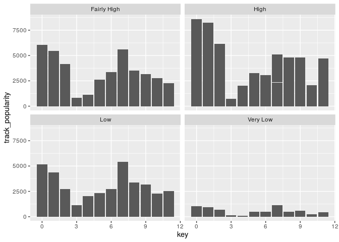<!-- -->

``` r
spotify_songs %>%
  filter(playlist_genre == "latin") %>%
  filter(mode == 0) %>%
  group_by(key) %>%
  ggplot(aes(y = track_popularity, x = key)) +
  geom_col() +
  facet_wrap(.~ popularity_level)
```

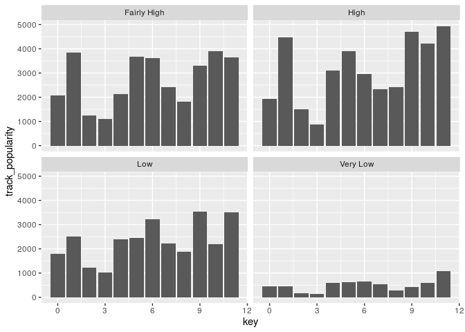<!-- -->

c = 0, c\# = 1, d = 2, d\# = 3,E = 4, F = 5, F\# = 6, G = 7, G\# = 8, A
= 9, A\# = 10, B = 11, NA = -1

\#\#Check popularity of a song with instrumentalness

``` r
spotify_songs %>%
  filter(playlist_genre == "latin") %>%
  ggplot(aes(y = track_popularity, x = instrumentalness)) +
  geom_hex() +
  facet_wrap(.~ popularity_level)
```

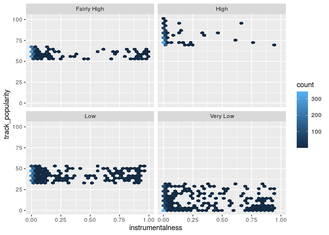<!-- -->

\#\#Check popularity of a song with duration

``` r
spotify_songs %>%
  filter(playlist_genre == "latin") %>%
  mutate(duration_minutes = duration_ms/(1000*60)) %>%
  ggplot(aes(x = duration_minutes, y = track_popularity)) +
  geom_point() +
  geom_smooth() 
```

    ## `geom_smooth()` using method = 'gam' and formula 'y ~ s(x, bs = "cs")'

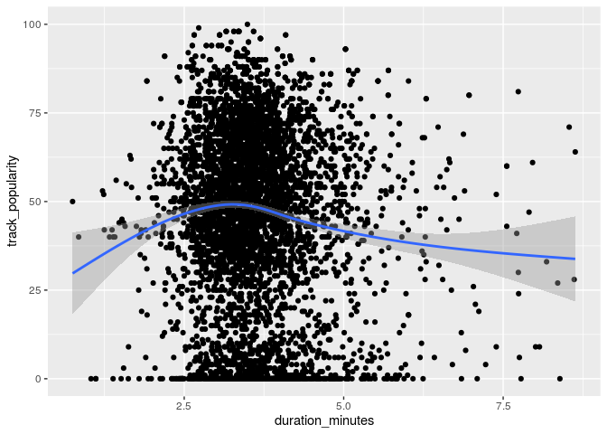<!-- --> We
can see that between 2.5-3.3 there are the most popular songs, which
makes sense since very long songs tend not to be so popular.

\#\#Check popularity of a song with tempo

``` r
spotify_songs %>%
  filter(playlist_genre == "latin") %>%
  ggplot(aes(x = tempo, y = track_popularity)) +
  geom_point() +
  geom_smooth() 
```

    ## `geom_smooth()` using method = 'gam' and formula 'y ~ s(x, bs = "cs")'

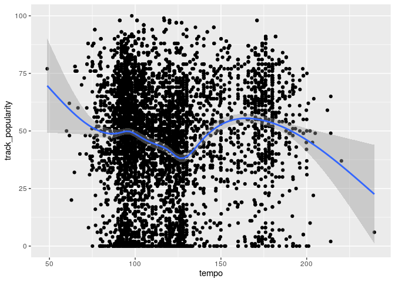<!-- -->

\#\#Check popularity of a song with speechiness

``` r
spotify_songs %>%
  filter(playlist_genre == "latin") %>%
  ggplot(aes(y = track_popularity, x = speechiness)) +
  geom_col() 
```

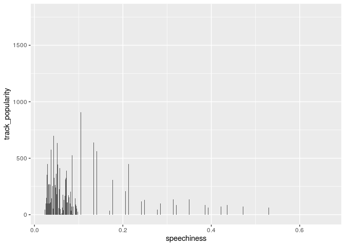<!-- -->

``` r
spotify_songs %>%
  filter(playlist_genre == "latin") %>%
  ggplot(aes(y = track_popularity, x = speechiness)) +
  geom_col() +
  facet_wrap(.~ popularity_level)
```

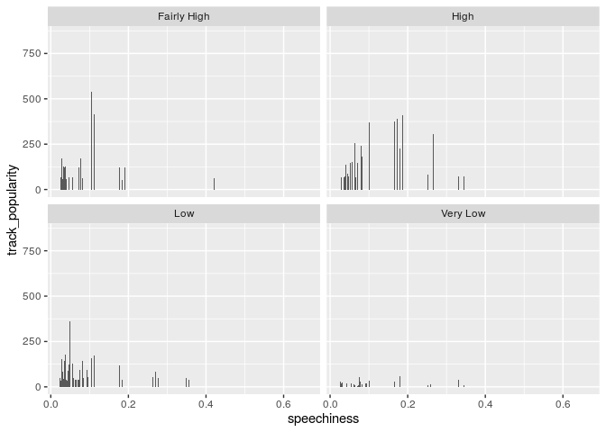<!-- -->

Most popular songs are below 0.25. “Speechiness detects the presence of
spoken words in a track. The more exclusively speech-like the recording
(e.g. talk show, audio book, poetry), the closer to 1.0 the attribute
value. Values above 0.66 describe tracks that are probably made entirely
of spoken words. Values between 0.33 and 0.66 describe tracks that may
contain both music and speech, either in sections or layered, including
such cases as rap music. Values below 0.33 most likely represent music
and other non-speech-like tracks.”

\#\#Check popularity of a song with mode

``` r
spotify_songs %>%
  filter(playlist_genre == "latin") %>%
  ggplot(aes(y = track_popularity,  x = mode)) +
  geom_col()
```

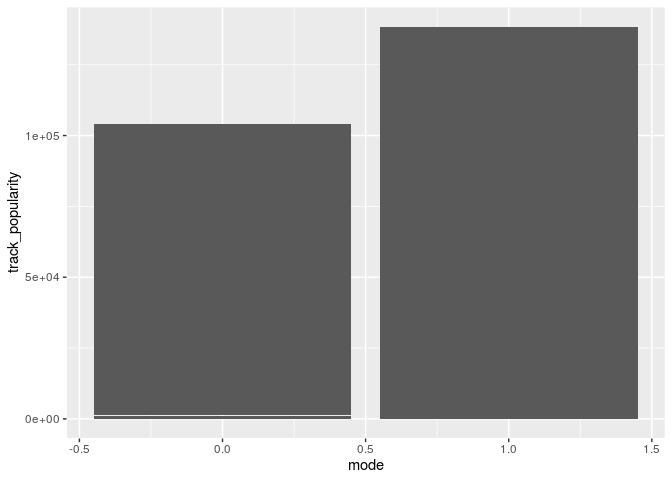<!-- -->

``` r
spotify_songs %>%
  filter(playlist_genre == "latin") %>%
  ggplot(aes(y = track_popularity,  x = mode)) +
  geom_col() +
  facet_wrap(.~ popularity_level)
```

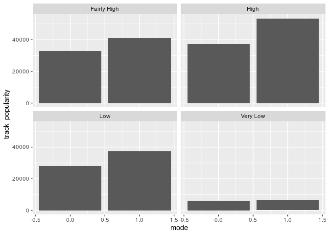<!-- -->

\#\#Check popularity of a song with danceability

``` r
spotify_songs %>%
  filter(playlist_genre == "latin") %>%
  ggplot(aes(y = track_popularity,  x = danceability)) +
  geom_col() 
```

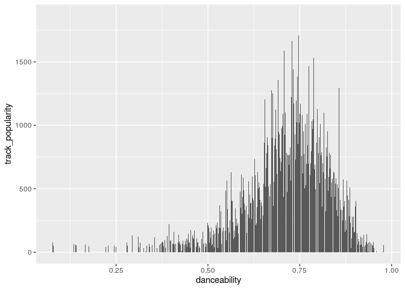<!-- -->

``` r
spotify_songs %>%
  filter(playlist_genre == "latin") %>%
  ggplot(aes(y = track_popularity,  x = danceability)) +
  geom_col() +
  facet_wrap(.~ popularity_level)
```

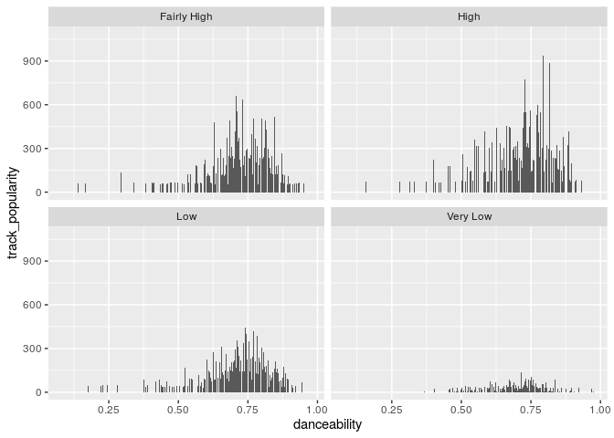<!-- -->

\#\#Check popularity of a song with release date

``` r
spotify_songs %>%
  filter(playlist_genre == "latin") %>%
  mutate(release_date = as_date(track_album_release_date)) %>%
  ggplot(aes(y = track_popularity,  x = release_date)) +
  geom_col()
```

    ## Warning: Problem with `mutate()` input `release_date`.
    ## ℹ  192 failed to parse.
    ## ℹ Input `release_date` is `as_date(track_album_release_date)`.

    ## Warning: 192 failed to parse.

    ## Warning: Removed 192 rows containing missing values (position_stack).

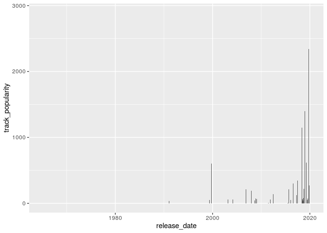<!-- -->

\#\#Check popularity of a song with energy

``` r
spotify_songs %>%
  filter(playlist_genre == "latin") %>%
  ggplot(aes(y = track_popularity,  x = energy)) +
  geom_col() 
```

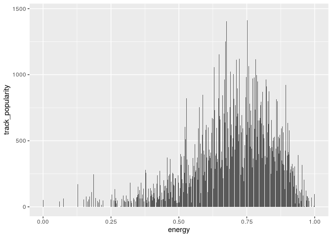<!-- -->

Seems like most popular are between 0.50 - 0.75. Not sure how useful it
is since we don’t have good definition of “energy”

\#\#Check popularity of a song with valence

``` r
spotify_songs %>%
  filter(playlist_genre == "latin") %>%
  ggplot(aes(y = track_popularity,  x = valence)) +
  geom_col()
```

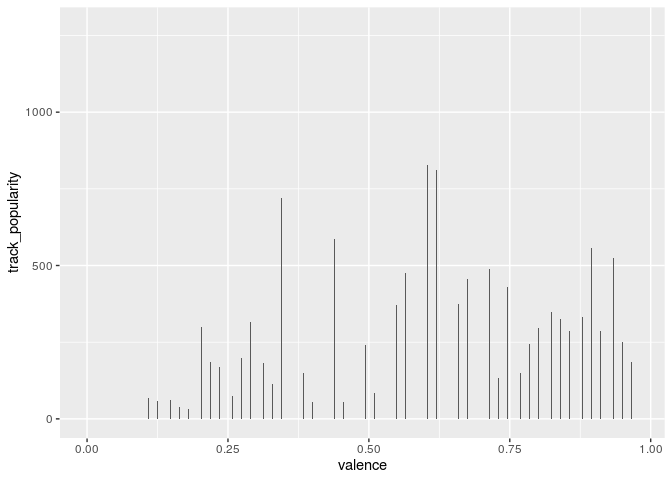<!-- -->

``` r
spotify_songs %>%
  filter(playlist_genre == "latin") %>%
  ggplot(aes(y = track_popularity,  x = valence)) +
  geom_col() +
  facet_wrap(.~ popularity_level)
```

<!-- -->

\#\#Check popularity of a song with liveliness INTERESTING

``` r
spotify_songs %>%
  filter(playlist_genre == "latin") %>%
  ggplot(aes(y = track_popularity,  x = liveness)) +
  geom_col()
```

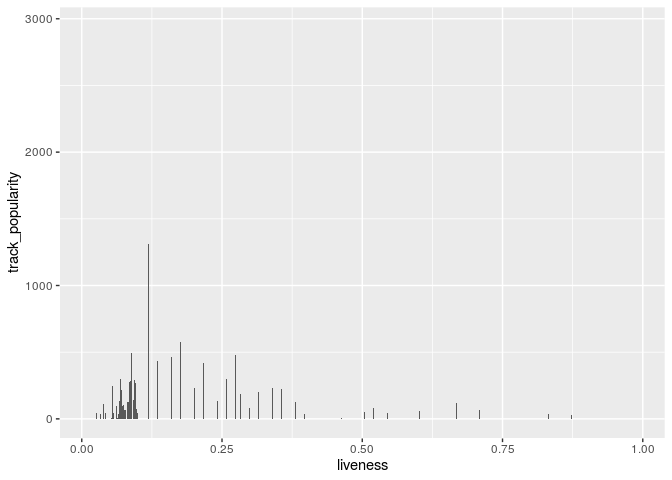<!-- -->

\#\#Check popularity of a song with acousticness

``` r
spotify_songs %>%
  filter(playlist_genre == "latin") %>% 
  group_by(popularity_level) %>%
  summarise(average_acousricness = mean(acousticness))
```

    ## `summarise()` ungrouping output (override with `.groups` argument)

    ## # A tibble: 4 x 2
    ##   popularity_level average_acousricness
    ##   <chr>                           <dbl>
    ## 1 Fairly High                     0.214
    ## 2 High                            0.221
    ## 3 Low                             0.231
    ## 4 Very Low                        0.173
