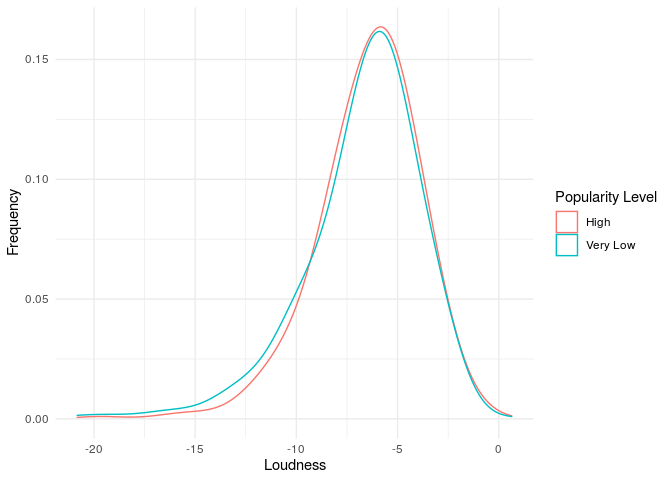

Alexandros - Rap - Latin
================

``` r
library(tidyverse)
```

    ## ── Attaching packages ─────────────────────────────────────── tidyverse 1.3.0 ──

    ## ✓ ggplot2 3.3.2     ✓ purrr   0.3.4
    ## ✓ tibble  3.0.4     ✓ dplyr   1.0.2
    ## ✓ tidyr   1.1.2     ✓ stringr 1.4.0
    ## ✓ readr   1.3.1     ✓ forcats 0.5.0

    ## ── Conflicts ────────────────────────────────────────── tidyverse_conflicts() ──
    ## x dplyr::filter() masks stats::filter()
    ## x dplyr::lag()    masks stats::lag()

``` r
library(here)
```

    ## here() starts at /cloud/project

``` r
library(lubridate)
```

    ## 
    ## Attaching package: 'lubridate'

    ## The following objects are masked from 'package:base':
    ## 
    ##     date, intersect, setdiff, union

``` r
library(patchwork)
library(ggridges)
```

``` r
spotify_songs <- read_csv(here('data/Spotify.csv'))
```

    ## Parsed with column specification:
    ## cols(
    ##   .default = col_double(),
    ##   track_id = col_character(),
    ##   track_name = col_character(),
    ##   track_artist = col_character(),
    ##   track_album_id = col_character(),
    ##   track_album_name = col_character(),
    ##   track_album_release_date = col_character(),
    ##   playlist_name = col_character(),
    ##   playlist_id = col_character(),
    ##   playlist_genre = col_character(),
    ##   playlist_subgenre = col_character()
    ## )

    ## See spec(...) for full column specifications.

\#\#Not important

``` r
spotify_songs <- spotify_songs %>%
mutate(popularity_level = case_when(
track_popularity <= 31 ~ "Very Low",
track_popularity > 31 & track_popularity <= 52 ~ "Low",
track_popularity > 52 & track_popularity <= 68 ~ "Fairly High",
track_popularity > 68 & track_popularity <= 100 ~ "High"
)) 
```

\#\#End of not important

\#PROPER ANALYSIS FOR RAP

``` r
rap_songs <- spotify_songs %>%
  filter(playlist_genre == "rap")
```

\#Summary for rap:

``` r
rap_songs %>%
summarise(min_pop = min(track_popularity), iqr_pop = IQR(track_popularity), med_pop = median(track_popularity), max_pop = max(track_popularity), quantile(track_popularity))
```

    ## # A tibble: 5 x 5
    ##   min_pop iqr_pop med_pop max_pop `quantile(track_popularity)`
    ##     <dbl>   <dbl>   <dbl>   <dbl>                        <dbl>
    ## 1       0      30      47      98                            0
    ## 2       0      30      47      98                           30
    ## 3       0      30      47      98                           47
    ## 4       0      30      47      98                           60
    ## 5       0      30      47      98                           98

\#Popularity level:

``` r
rap_songs <- rap_songs %>%
mutate(popularity_level = case_when(
track_popularity <= 30 ~ "Very Low",
track_popularity > 30 & track_popularity <= 47 ~ "Low",
track_popularity > 47 & track_popularity <= 60 ~ "Fairly High",
track_popularity > 60 & track_popularity <= 98 ~ "High"
)) 
```

\#Median values:

``` r
rap_songs %>%
  filter(popularity_level == c("High", "Very Low")) %>%
  group_by(popularity_level) %>%
  summarise(med_dance = median(danceability),
            med_energy = median(energy),
            med_tempo = median(tempo),
            med_duration_s = median(duration_ms)/(1000*60),
            med_speech = median(speechiness),
            med_acoustic = median(acousticness)) 
```

    ## `summarise()` ungrouping output (override with `.groups` argument)

    ## # A tibble: 2 x 7
    ##   popularity_level med_dance med_energy med_tempo med_duration_s med_speech
    ##   <chr>                <dbl>      <dbl>     <dbl>          <dbl>      <dbl>
    ## 1 High                 0.778      0.652      125.           3.50      0.164
    ## 2 Very Low             0.724      0.691      110.           3.76      0.209
    ## # … with 1 more variable: med_acoustic <dbl>

From the above table it seems that popular songs have a higher
danceability, accousticness and tempo. On the other hand, energy and
speechiness is a little lower than that of unpopular songs.

\#Check popularity of a song with key and mode

\#Graphs for each variable

``` r
danceability_graph_rap <- rap_songs %>%
  filter(popularity_level == c("High", "Very Low")) %>%
  ggplot(aes(x = danceability, color = popularity_level)) +
  geom_density(adjust = 2) +
    labs(x = "Danceability",
       y = "Frequency",
       color = "Popularity Level") +
  theme_minimal()
```

Songs that have a dancability above 0.75 are more likely to be more
highly popular than unpopular. Also the most popular songs have a
danceability of 0.8.

\#Energy

``` r
rap_songs %>%
  filter(popularity_level == c("High", "Very Low")) %>%
  ggplot(aes(x = energy, color = popularity_level)) +
  geom_density(adjust = 2) +
  labs(x = "Energy",
       y = "Frequency",
       color = "Popularity Level") +
  theme_minimal()
```

<!-- -->

If a song has energy between 0.27 and 0.75 it is more likely to have a
high popularity than a very low one. On the other hand, if it has an
energy outside the above range it is more likely to have a very low
popularity level.

\#Valence

``` r
rap_songs %>%
  filter(popularity_level == c("High", "Very Low")) %>%
  ggplot(aes(x = valence, color = popularity_level)) +
  geom_density(adjust = 2) +
    labs(x = "Valence",
       y = "Frequency",
       color = "Popularity Level") +
  theme_minimal()
```

<!-- -->

From the above graph we can see that rap songs with valence in the range
of 0.23 - 0.80 are more likely to have a high popularity level than a
very low one.

# Acousticness

``` r
rap_songs %>%
  filter(popularity_level == c("High", "Very Low")) %>%
  ggplot(aes(x = acousticness, color = popularity_level)) +
  geom_density(adjust = 2) +
    labs(x = "Acousticness",
       y = "Frequency",
       color = "Popularity Level") +
  theme_minimal()
```

<!-- -->

The distribution shows that a rap sang with high popularity is more
likely to have an accousticness between 0.00 and 0.12. On the other
hand, if it has a danceability above 0.12 it is more likely to be very
unpopular.

# Loudness

``` r
rap_songs %>%
  filter(popularity_level == c("High", "Very Low")) %>%
  ggplot(aes(x = loudness, color = popularity_level)) +
  geom_density(adjust = 2) +
    labs(x = "Loudness",
       y = "Frequency",
       color = "Popularity Level") +
  theme_minimal()
```

<!-- -->

If a song has a loudness higher than -6.8 it is more likely to have a
high popularity level.

# Duration

``` r
rap_songs %>%
  filter(popularity_level == c("High", "Very Low")) %>%
  ggplot(aes(x = duration_ms/(1000*60), color = popularity_level)) +
  geom_density(adjust = 2) +
    labs(x = "Duration (min)",
       y = "Frequency",
       color = "Popularity Level") +
  theme_minimal()
```

<!-- -->

From the graph we can see that on average a rap song with a duration in
the range of 1.5 and 3.5 minutes is more likely to be popular than
unpopular.

\#PROPER ANALYSIS FOR LATIN

``` r
latin_songs <- spotify_songs %>%
  filter(playlist_genre == "latin")
```

\#Summary for latin:

``` r
latin_songs %>%
summarise(min_pop = min(track_popularity), iqr_pop = IQR(track_popularity), med_pop = median(track_popularity), max_pop = max(track_popularity), quantile(track_popularity))
```

    ## # A tibble: 5 x 5
    ##   min_pop iqr_pop med_pop max_pop `quantile(track_popularity)`
    ##     <dbl>   <dbl>   <dbl>   <dbl>                        <dbl>
    ## 1       0      35      50     100                            0
    ## 2       0      35      50     100                           32
    ## 3       0      35      50     100                           50
    ## 4       0      35      50     100                           67
    ## 5       0      35      50     100                          100

\#Popularity level latin:

``` r
latin_songs <- latin_songs %>%
mutate(popularity_level = case_when(
track_popularity <= 32 ~ "Very Low",
track_popularity > 32 & track_popularity <= 50 ~ "Low",
track_popularity > 50 & track_popularity <= 67 ~ "Fairly High",
track_popularity > 67 & track_popularity <= 100 ~ "High"
)) 
```

\#Median values latin:

``` r
latin_songs %>%
  filter(popularity_level == c("High", "Very Low")) %>%
  group_by(popularity_level) %>%
  summarise(med_dance = median(danceability),
            med_energy = median(energy),
            med_tempo = median(tempo),
            med_duration_s = median(duration_ms)/(1000*60),
            med_speech = median(speechiness),
            med_acoustic = median(acousticness)) 
```

    ## Warning in popularity_level == c("High", "Very Low"): longer object length is
    ## not a multiple of shorter object length

    ## `summarise()` ungrouping output (override with `.groups` argument)

    ## # A tibble: 2 x 7
    ##   popularity_level med_dance med_energy med_tempo med_duration_s med_speech
    ##   <chr>                <dbl>      <dbl>     <dbl>          <dbl>      <dbl>
    ## 1 High                 0.744      0.711      105.           3.51     0.0795
    ## 2 Very Low             0.718      0.758      115.           3.65     0.0610
    ## # … with 1 more variable: med_acoustic <dbl>

From the above table we can see that popular latin songs have a higher
danceability, speechiness, and accousticness. On the other hand,
unpopular latin songs have a higher energy, tempo and a slightly higher
duration.

\#Check popularity of a song with key and mode

\#Graphs for each variable latin

``` r
danceability_graph_latin <- latin_songs %>%
  filter(popularity_level == c("High", "Very Low")) %>%
  ggplot(aes(x = danceability, color = popularity_level)) +
  geom_density(adjust = 2) +
    labs(x = "Danceability",
       y = "Frequency",
       color = "Popularity Level") +
  theme_minimal()
```

    ## Warning in popularity_level == c("High", "Very Low"): longer object length is
    ## not a multiple of shorter object length

Latin songs that have a dancability above 0.73 are more likely to be
more highly popular than unpopular. Also the most popular songs have a
danceability of 0.75.

\#Energy latin

``` r
latin_songs %>%
  filter(popularity_level == c("High", "Very Low")) %>%
  ggplot(aes(x = energy, color = popularity_level)) +
  geom_density(adjust = 2) +
  labs(x = "Energy",
       y = "Frequency",
       color = "Popularity Level") +
  theme_minimal()
```

    ## Warning in popularity_level == c("High", "Very Low"): longer object length is
    ## not a multiple of shorter object length

<!-- -->

If a song has energy between 0.27 and 0.80 it is more likely to have a
high popularity than a very low one. On the other hand, if it has an
energy outside the above range it is more likely to have a very low
popularity level.

\#Valence latin

``` r
latin_songs %>%
  filter(popularity_level == c("High", "Very Low")) %>%
  ggplot(aes(x = valence, color = popularity_level)) +
  geom_density(adjust = 2) +
    labs(x = "Valence",
       y = "Frequency",
       color = "Popularity Level") +
  theme_minimal()
```

    ## Warning in popularity_level == c("High", "Very Low"): longer object length is
    ## not a multiple of shorter object length

<!-- -->

From the above graph we can see that latin songs with valence in the
range of 0.45 - 0.80 are more likely to have a high popularity level
than a very low one.

# Acousticness latin

``` r
latin_songs %>%
  filter(popularity_level == c("High", "Very Low")) %>%
  ggplot(aes(x = acousticness, color = popularity_level)) +
  geom_density(adjust = 2) +
    labs(x = "Acousticness",
       y = "Frequency",
       color = "Popularity Level") +
  theme_minimal()
```

    ## Warning in popularity_level == c("High", "Very Low"): longer object length is
    ## not a multiple of shorter object length

<!-- -->

The distribution shows that a latin sang with high popularity is more
likely to have an accousticness between 0.00 and 0.13. On the other
hand, if it has a danceability above 0.12 it is more likely to be very
unpopular.

# Loudness latin

``` r
latin_songs %>%
  filter(popularity_level == c("High", "Very Low")) %>%
  ggplot(aes(x = loudness, color = popularity_level)) +
  geom_density(adjust = 2) +
    labs(x = "Loudness",
       y = "Frequency",
       color = "Popularity Level") +
  theme_minimal()
```

    ## Warning in popularity_level == c("High", "Very Low"): longer object length is
    ## not a multiple of shorter object length

<!-- -->

If a latin song has a loudness higher than -6.8 it is more likely to
have a high popularity level.

# Duration latin

``` r
latin_songs %>%
  filter(popularity_level == c("High", "Very Low")) %>%
  ggplot(aes(x = duration_ms/(1000*60), color = popularity_level)) +
  geom_density(adjust = 2) +
    labs(x = "Duration (min)",
       y = "Frequency",
       color = "Popularity Level") +
  theme_minimal()
```

    ## Warning in popularity_level == c("High", "Very Low"): longer object length is
    ## not a multiple of shorter object length

<!-- -->

From the graph we can see that on average a latin song with a duration
in the range of 2.5 and 3.8 minutes is more likely to be popular than
unpopular.

\#Comparison of Rap and Latin

\#Danceability

``` r
spotify_songs %>%
  filter(playlist_genre == c("rap", "latin")) %>%
  filter(popularity_level == c("High", "Very Low")) %>%
  group_by(playlist_genre) %>%
  ggplot(mapping = aes(x = danceability, y = playlist_genre, colour = popularity_level, fill = popularity_level)) +
  geom_density_ridges(alpha = 0.25) +
  theme_minimal() + 
   scale_fill_viridis_d() + 
  labs(x = "Danceability",
       y = NULL)
```

    ## Warning in playlist_genre == c("rap", "latin"): longer object length is not a
    ## multiple of shorter object length

    ## Picking joint bandwidth of 0.0326

<!-- -->

From the above graph we can see that there is a common range of
danceability for the two genres that make a song very popular. This
range is between a danceability of 0.75 and 0.90

Takeaway: If a song has a danceability between 0.75-0.90 is more likely
to be highly popular in rap and latin

\#Energy

``` r
spotify_songs %>%
  filter(playlist_genre == c("rap", "latin")) %>%
  filter(popularity_level == c("High", "Very Low")) %>%
  group_by(playlist_genre) %>%
  ggplot(mapping = aes(x = energy, y = playlist_genre, colour = popularity_level, fill = popularity_level)) +
  geom_density_ridges(alpha = 0.25) +
  theme_minimal() + 
   scale_fill_viridis_d() + 
  labs(x = "Energy",
       y = NULL)
```

    ## Warning in playlist_genre == c("rap", "latin"): longer object length is not a
    ## multiple of shorter object length

    ## Picking joint bandwidth of 0.0423

<!-- -->

Common range: 0.45-0.75

Takeaway: If a song has an energy between 0.45-0.75 is more likely to be
highly popular in rap and latin

\#Valence

``` r
spotify_songs %>%
  filter(playlist_genre == c("rap", "latin")) %>%
  filter(popularity_level == c("High", "Very Low")) %>%
  group_by(playlist_genre) %>%
  ggplot(mapping = aes(x = valence, y = playlist_genre, colour = popularity_level, fill = popularity_level)) +
  geom_density_ridges(alpha = 0.25) +
  theme_minimal() + 
   scale_fill_viridis_d() + 
  labs(x = "Valence",
       y = NULL)
```

    ## Warning in playlist_genre == c("rap", "latin"): longer object length is not a
    ## multiple of shorter object length

    ## Picking joint bandwidth of 0.0648

<!-- -->

Common range: 0.0-0.45. HOWEVER in latin if a song has a valence in the
range of 0.6-0.7 it is more likely to have a high popularity, which does
not happen in rap.

Takeaway: If a song has a valence between 0.0-0.45 is more likely to be
highly popular in rap and latin. Only in latin a song with a valence
betwen 0.6-0.7 is more likely to be highly popular.

\#Acousticness

``` r
spotify_songs %>%
  filter(playlist_genre == c("rap", "latin")) %>%
  filter(popularity_level == c("High", "Very Low")) %>%
  group_by(playlist_genre) %>%
  ggplot(mapping = aes(x = acousticness, y = playlist_genre, colour = popularity_level, fill = popularity_level)) +
  geom_density_ridges(alpha = 0.25) +
  theme_minimal() + 
   scale_fill_viridis_d() + 
  labs(x = "Acousticness",
       y = NULL)
```

    ## Warning in playlist_genre == c("rap", "latin"): longer object length is not a
    ## multiple of shorter object length

    ## Picking joint bandwidth of 0.0478

<!-- -->

Common range: 0.18-0.62, WITH SMALL difference for rap in the range of
0.42-0.5

Takeaway: If a song has an accousticness between 0.18-0.62 is more
likely to be highly popular in rap and latin. EXCEPTION

\#Loudness

``` r
spotify_songs %>%
  filter(playlist_genre == c("rap", "latin")) %>%
  filter(popularity_level == c("High", "Very Low")) %>%
  group_by(playlist_genre) %>%
  ggplot(mapping = aes(x = loudness, y = playlist_genre, colour = popularity_level, fill = popularity_level)) +
  geom_density_ridges(alpha = 0.25) +
  theme_minimal() + 
   scale_fill_viridis_d() + 
  labs(x = "Loudness",
       y = NULL)
```

    ## Warning in playlist_genre == c("rap", "latin"): longer object length is not a
    ## multiple of shorter object length

    ## Picking joint bandwidth of 0.632

<!-- -->

Common range: -7–4. Range is a little small

Takeaway: If a song has a loudness between -7–4 is more likely to be
highly popular in rap and latin.

\#Duration

``` r
spotify_songs %>%
  filter(playlist_genre == c("rap", "latin")) %>%
  filter(popularity_level == c("High", "Very Low")) %>%
  group_by(playlist_genre) %>%
  ggplot(mapping = aes(x = duration_ms/(1000*60), y = playlist_genre, colour = popularity_level, fill = popularity_level)) +
  geom_density_ridges(alpha = 0.25) +
  theme_minimal() + 
   scale_fill_viridis_d() + 
  labs(x = "Duration (min)",
       y = NULL)
```

    ## Warning in playlist_genre == c("rap", "latin"): longer object length is not a
    ## multiple of shorter object length

    ## Picking joint bandwidth of 0.214

<!-- -->

Common range: 2.00-3.75

Takeaway: If a song has a loudness between 2.00-3.75 is more likely to
be highly popular in rap and latin.

\#END OF COMPARISON AND NICE ANALYSIS

\#\#RAP

``` r
spotify_songs %>%
filter(playlist_genre == "rap") %>%
summarise(min_pop = min(track_popularity), iqr_pop = IQR(track_popularity), med_pop = median(track_popularity), max_pop = max(track_popularity), quantile(track_popularity))
```

    ## # A tibble: 5 x 5
    ##   min_pop iqr_pop med_pop max_pop `quantile(track_popularity)`
    ##     <dbl>   <dbl>   <dbl>   <dbl>                        <dbl>
    ## 1       0      30      47      98                            0
    ## 2       0      30      47      98                           30
    ## 3       0      30      47      98                           47
    ## 4       0      30      47      98                           60
    ## 5       0      30      47      98                           98

\#\#Check popularity of a song with instrumentalness

``` r
spotify_songs %>%
  filter(playlist_genre == "rap") %>%
  ggplot(aes(y = track_popularity, x = instrumentalness)) +
  geom_hex() +
  facet_wrap(.~ popularity_level)
```

<!-- -->

\#\#Check popularity of a song with duration

``` r
spotify_songs %>%
  filter(playlist_genre == "rap") %>%
  mutate(duration_minutes = duration_ms/(1000*60)) %>%
  ggplot(aes(x = duration_minutes, y = track_popularity)) +
  geom_point() +
  geom_smooth() 
```

    ## `geom_smooth()` using method = 'gam' and formula 'y ~ s(x, bs = "cs")'

<!-- -->

``` r
spotify_songs %>%
  filter(playlist_genre == "rap",track_popularity > 68) %>%
  summarise(average_duration_rap = mean(duration_ms)/(1000*60))
```

    ## # A tibble: 1 x 1
    ##   average_duration_rap
    ##                  <dbl>
    ## 1                 3.51

We can see that between 2.5-3.3 there are the most popular songs, which
makes sense since very long songs tend not to be so popular.

\#\#Check popularity of a song with tempo

``` r
spotify_songs %>%
  filter(playlist_genre == "rap") %>%
  ggplot(aes(x = tempo, y = track_popularity)) +
  geom_point() +
  geom_smooth() 
```

    ## `geom_smooth()` using method = 'gam' and formula 'y ~ s(x, bs = "cs")'

<!-- -->

``` r
#CHECK VARIATION
spotify_songs %>%
  filter(playlist_genre == "rap",track_popularity > 68) %>%
  summarise(average_tempo = mean(tempo))
```

    ## # A tibble: 1 x 1
    ##   average_tempo
    ##           <dbl>
    ## 1          125.

\#\#Check popularity of a song with speechiness

``` r
spotify_songs %>%
  filter(playlist_genre == "rap") %>%
  ggplot(aes(y = track_popularity, x = speechiness)) +
  geom_col() 
```

<!-- -->

``` r
spotify_songs %>%
  filter(playlist_genre == "rap") %>%
  ggplot(aes(y = track_popularity, x = speechiness)) +
  geom_col() +
  facet_wrap(.~ popularity_level)
```

<!-- -->

``` r
spotify_songs %>%
  filter(playlist_genre == "rap",track_popularity > 68) %>%
  summarise(average_speechness = mean(speechiness))
```

    ## # A tibble: 1 x 1
    ##   average_speechness
    ##                <dbl>
    ## 1              0.190

Most popular songs are below 0.25. “Speechiness detects the presence of
spoken words in a track. The more exclusively speech-like the recording
(e.g. talk show, audio book, poetry), the closer to 1.0 the attribute
value. Values above 0.66 describe tracks that are probably made entirely
of spoken words. Values between 0.33 and 0.66 describe tracks that may
contain both music and speech, either in sections or layered, including
such cases as rap music. Values below 0.33 most likely represent music
and other non-speech-like tracks.”

\#\#Check popularity of a song with mode

\#\#Check popularity of a song with danceability

``` r
spotify_songs %>%
  filter(playlist_genre == "rap") %>%
  ggplot(aes(y = track_popularity,  x = danceability)) +
  geom_col() 
```

<!-- -->

``` r
spotify_songs %>%
  filter(playlist_genre == "rap") %>%
  ggplot(aes(y = track_popularity,  x = danceability)) +
  geom_col() +
  facet_wrap(.~ popularity_level)
```

<!-- -->

``` r
spotify_songs %>%
  filter(playlist_genre == "rap",track_popularity > 68) %>%
  summarise(average_danceability = mean(danceability))
```

    ## # A tibble: 1 x 1
    ##   average_danceability
    ##                  <dbl>
    ## 1                0.768

\#\#Check popularity of a song with release date

``` r
spotify_songs %>%
  filter(playlist_genre == "rap") %>%
  mutate(release_date = as_date(track_album_release_date)) %>%
  ggplot(aes(y = track_popularity,  x = release_date)) +
  geom_col()
```

    ## Warning: Problem with `mutate()` input `release_date`.
    ## ℹ  275 failed to parse.
    ## ℹ Input `release_date` is `as_date(track_album_release_date)`.

    ## Warning: 275 failed to parse.

    ## Warning: Removed 275 rows containing missing values (position_stack).

<!-- -->

\#\#Check popularity of a song with energy

``` r
spotify_songs %>%
  filter(playlist_genre == "rap") %>%
  ggplot(aes(y = track_popularity,  x = energy)) +
  geom_col() 
```

<!-- -->

``` r
spotify_songs %>%
  filter(playlist_genre == "rap",track_popularity > 68) %>%
  summarise(average_energy = mean(energy))
```

    ## # A tibble: 1 x 1
    ##   average_energy
    ##            <dbl>
    ## 1          0.643

Seems like most popular are between 0.50 - 0.75. Not sure how useful it
is since we don’t have good definition of “energy”

\#\#Check popularity of a song with valence

``` r
spotify_songs %>%
  filter(playlist_genre == "rap") %>%
  ggplot(aes(y = track_popularity,  x = valence)) +
  geom_col()
```

<!-- -->

``` r
spotify_songs %>%
  filter(playlist_genre == "rap") %>%
  ggplot(aes(y = track_popularity,  x = valence)) +
  geom_col() +
  facet_wrap(.~ popularity_level)
```

<!-- -->

``` r
spotify_songs %>%
  filter(playlist_genre == "rap",track_popularity > 68) %>%
  summarise(average_valence = mean(valence))
```

    ## # A tibble: 1 x 1
    ##   average_valence
    ##             <dbl>
    ## 1           0.505

\#\#Check popularity of a song with liveliness INTERESTING

``` r
spotify_songs %>%
  filter(playlist_genre == "rap") %>%
  ggplot(aes(y = track_popularity,  x = liveness)) +
  geom_col()
```

<!-- -->

``` r
spotify_songs %>%
  filter(playlist_genre == "rap",track_popularity > 68) %>%
  summarise(average_liveness = mean(liveness))
```

    ## # A tibble: 1 x 1
    ##   average_liveness
    ##              <dbl>
    ## 1            0.178

\#\#Check popularity of a song with acousticness

``` r
spotify_songs %>%
  filter(playlist_genre == "rap") %>% 
  group_by(popularity_level) %>%
  summarise(average_acousricness = mean(acousticness))
```

    ## `summarise()` ungrouping output (override with `.groups` argument)

    ## # A tibble: 4 x 2
    ##   popularity_level average_acousricness
    ##   <chr>                           <dbl>
    ## 1 Fairly High                     0.213
    ## 2 High                            0.169
    ## 3 Low                             0.209
    ## 4 Very Low                        0.161

``` r
spotify_songs %>%
  filter(playlist_genre == "rap",track_popularity > 68) %>%
  summarise(average_accousticness = mean(acousticness))
```

    ## # A tibble: 1 x 1
    ##   average_accousticness
    ##                   <dbl>
    ## 1                 0.169

\#\#LATIN

``` r
spotify_songs %>%
filter(playlist_genre == "latin") %>%
summarise(min_pop = min(track_popularity), iqr_pop = IQR(track_popularity), med_pop = median(track_popularity), max_pop = max(track_popularity), quantile(track_popularity))
```

    ## # A tibble: 5 x 5
    ##   min_pop iqr_pop med_pop max_pop `quantile(track_popularity)`
    ##     <dbl>   <dbl>   <dbl>   <dbl>                        <dbl>
    ## 1       0      35      50     100                            0
    ## 2       0      35      50     100                           32
    ## 3       0      35      50     100                           50
    ## 4       0      35      50     100                           67
    ## 5       0      35      50     100                          100

\#\#Check popularity of a song with instrumentalness

``` r
spotify_songs %>%
  filter(playlist_genre == "latin") %>%
  ggplot(aes(y = track_popularity, x = instrumentalness)) +
  geom_hex() +
  facet_wrap(.~ popularity_level)
```

<!-- -->

\#\#Check popularity of a song with duration

``` r
spotify_songs %>%
  filter(playlist_genre == "latin") %>%
  mutate(duration_minutes = duration_ms/(1000*60)) %>%
  ggplot(aes(x = duration_minutes, y = track_popularity)) +
  geom_point() +
  geom_smooth() 
```

    ## `geom_smooth()` using method = 'gam' and formula 'y ~ s(x, bs = "cs")'

<!-- -->

``` r
spotify_songs %>%
  filter(playlist_genre == "latin",track_popularity > 68) %>%
  summarise(average_duration_latin = mean(duration_ms)/(1000*60))
```

    ## # A tibble: 1 x 1
    ##   average_duration_latin
    ##                    <dbl>
    ## 1                   3.59

We can see that between 2.5-3.3 there are the most popular songs, which
makes sense since very long songs tend not to be so popular.

\#\#Check popularity of a song with tempo

``` r
spotify_songs %>%
  filter(playlist_genre == "latin") %>%
  ggplot(aes(x = tempo, y = track_popularity)) +
  geom_point() +
  geom_smooth() 
```

    ## `geom_smooth()` using method = 'gam' and formula 'y ~ s(x, bs = "cs")'

<!-- -->

``` r
spotify_songs %>%
  filter(playlist_genre == "latin",track_popularity > 68) %>%
  summarise(average_tempo = mean(tempo))
```

    ## # A tibble: 1 x 1
    ##   average_tempo
    ##           <dbl>
    ## 1          120.

\#\#Check popularity of a song with speechiness

``` r
spotify_songs %>%
  filter(playlist_genre == "latin") %>%
  ggplot(aes(y = track_popularity, x = speechiness)) +
  geom_col() 
```

<!-- -->

``` r
spotify_songs %>%
  filter(playlist_genre == "latin") %>%
  ggplot(aes(y = track_popularity, x = speechiness)) +
  geom_col() +
  facet_wrap(.~ popularity_level)
```

<!-- -->

Most popular songs are below 0.25. “Speechiness detects the presence of
spoken words in a track. The more exclusively speech-like the recording
(e.g. talk show, audio book, poetry), the closer to 1.0 the attribute
value. Values above 0.66 describe tracks that are probably made entirely
of spoken words. Values between 0.33 and 0.66 describe tracks that may
contain both music and speech, either in sections or layered, including
such cases as rap music. Values below 0.33 most likely represent music
and other non-speech-like tracks.”

\#\#Check popularity of a song with mode

\#\#Check popularity of a song with danceability

``` r
spotify_songs %>%
  filter(playlist_genre == "latin") %>%
  ggplot(aes(y = track_popularity,  x = danceability)) +
  geom_col() 
```

<!-- -->

``` r
spotify_songs %>%
  filter(playlist_genre == "latin") %>%
  ggplot(aes(y = track_popularity,  x = danceability)) +
  geom_col() +
  facet_wrap(.~ popularity_level)
```

<!-- -->

``` r
spotify_songs %>%
  filter(playlist_genre == "latin",track_popularity > 68) %>%
  summarise(average_danceability_latin = mean(danceability))
```

    ## # A tibble: 1 x 1
    ##   average_danceability_latin
    ##                        <dbl>
    ## 1                      0.721

\#\#Check popularity of a song with release date

``` r
spotify_songs %>%
  filter(playlist_genre == "latin") %>%
  mutate(release_date = as_date(track_album_release_date)) %>%
  ggplot(aes(y = track_popularity,  x = release_date)) +
  geom_col()
```

    ## Warning: Problem with `mutate()` input `release_date`.
    ## ℹ  192 failed to parse.
    ## ℹ Input `release_date` is `as_date(track_album_release_date)`.

    ## Warning: 192 failed to parse.

    ## Warning: Removed 192 rows containing missing values (position_stack).

<!-- -->

\#\#Check popularity of a song with energy

``` r
spotify_songs %>%
  filter(playlist_genre == "latin") %>%
  ggplot(aes(y = track_popularity,  x = energy)) +
  geom_col() 
```

<!-- -->

``` r
spotify_songs %>%
  filter(playlist_genre == "latin",track_popularity > 68) %>%
  summarise(average_energy_latin = mean(energy))
```

    ## # A tibble: 1 x 1
    ##   average_energy_latin
    ##                  <dbl>
    ## 1                0.695

Seems like most popular are between 0.50 - 0.75. Not sure how useful it
is since we don’t have good definition of “energy”

\#\#Check popularity of a song with valence

``` r
spotify_songs %>%
  filter(playlist_genre == "latin") %>%
  ggplot(aes(y = track_popularity,  x = valence)) +
  geom_col()
```

<!-- -->

``` r
spotify_songs %>%
  filter(playlist_genre == "latin") %>%
  ggplot(aes(y = track_popularity,  x = valence)) +
  geom_col() +
  facet_wrap(.~ popularity_level)
```

<!-- -->

``` r
spotify_songs %>%
  filter(playlist_genre == "latin",track_popularity > 68) %>%
  summarise(average_valence_latin = mean(valence))
```

    ## # A tibble: 1 x 1
    ##   average_valence_latin
    ##                   <dbl>
    ## 1                 0.604

\#\#Check popularity of a song with liveliness INTERESTING

``` r
spotify_songs %>%
  filter(playlist_genre == "latin") %>%
  ggplot(aes(y = track_popularity,  x = liveness)) +
  geom_col()
```

<!-- -->

``` r
spotify_songs %>%
  filter(playlist_genre == "latin",track_popularity > 68) %>%
  summarise(average_liveness_latin = mean(liveness))
```

    ## # A tibble: 1 x 1
    ##   average_liveness_latin
    ##                    <dbl>
    ## 1                  0.172

\#\#Check popularity of a song with acousticness

``` r
spotify_songs %>%
  filter(playlist_genre == "latin") %>% 
  group_by(popularity_level) %>%
  summarise(average_acousricness = mean(acousticness))
```

    ## `summarise()` ungrouping output (override with `.groups` argument)

    ## # A tibble: 4 x 2
    ##   popularity_level average_acousricness
    ##   <chr>                           <dbl>
    ## 1 Fairly High                     0.214
    ## 2 High                            0.221
    ## 3 Low                             0.231
    ## 4 Very Low                        0.173

``` r
spotify_songs %>%
  filter(playlist_genre == "latin",track_popularity > 68) %>%
  summarise(average_accousticness_latin = mean(acousticness))
```

    ## # A tibble: 1 x 1
    ##   average_accousticness_latin
    ##                         <dbl>
    ## 1                       0.221

\#\#\#ISSUE: MAKE COMPARISON OF VARIABLES THAT CANNOT BE COMAPRED WITH
RIDGE GRAPHS

\#\#Add levels to other genre (rock,edm, r\&b):

\#EDM:

``` r
edm_songs <- spotify_songs %>%
  filter(playlist_genre == "edm")
```

\#Summary for edm:

``` r
edm_songs %>%
summarise(min_pop = min(track_popularity),
          iqr_pop = IQR(track_popularity), 
          med_pop = median(track_popularity), 
          max_pop = max(track_popularity), 
          quantile(track_popularity))
```

    ## # A tibble: 5 x 5
    ##   min_pop iqr_pop med_pop max_pop `quantile(track_popularity)`
    ##     <dbl>   <dbl>   <dbl>   <dbl>                        <dbl>
    ## 1       0      34      36      99                            0
    ## 2       0      34      36      99                           17
    ## 3       0      34      36      99                           36
    ## 4       0      34      36      99                           51
    ## 5       0      34      36      99                           99

\#Popularity level:

``` r
edm_songs <- edm_songs %>%
mutate(popularity_level = case_when(
track_popularity <= 17 ~ "Very Low",
track_popularity > 17 & track_popularity <= 36 ~ "Low",
track_popularity > 36 & track_popularity <= 51 ~ "Fairly High",
track_popularity > 51 & track_popularity <= 99 ~ "High"
)) 
```

\#Rock:

``` r
rock_songs <- spotify_songs %>%
  filter(playlist_genre == "rock")
```

\#Summary for rock:

``` r
rock_songs %>%
summarise(min_pop = min(track_popularity),
          iqr_pop = IQR(track_popularity), 
          med_pop = median(track_popularity), 
          max_pop = max(track_popularity), 
          quantile(track_popularity))
```

    ## # A tibble: 5 x 5
    ##   min_pop iqr_pop med_pop max_pop `quantile(track_popularity)`
    ##     <dbl>   <dbl>   <dbl>   <dbl>                        <dbl>
    ## 1       0      42      46      95                            0
    ## 2       0      42      46      95                           21
    ## 3       0      42      46      95                           46
    ## 4       0      42      46      95                           63
    ## 5       0      42      46      95                           95

\#Popularity level:

``` r
rock_songs <- rock_songs %>%
mutate(popularity_level = case_when(
track_popularity <= 21 ~ "Very Low",
track_popularity > 21 & track_popularity <= 46 ~ "Low",
track_popularity > 46 & track_popularity <= 63 ~ "Fairly High",
track_popularity > 63 & track_popularity <= 95 ~ "High"
)) 
```

\#R\&b:

``` r
rnb_songs <- spotify_songs %>%
  filter(playlist_genre == "r&b")
```

\#Summary for r\&b:

``` r
rnb_songs %>%
summarise(min_pop = min(track_popularity),
          iqr_pop = IQR(track_popularity), 
          med_pop = median(track_popularity), 
          max_pop = max(track_popularity), 
          quantile(track_popularity))
```

    ## # A tibble: 5 x 5
    ##   min_pop iqr_pop med_pop max_pop `quantile(track_popularity)`
    ##     <dbl>   <dbl>   <dbl>   <dbl>                        <dbl>
    ## 1       0      42      44      99                            0
    ## 2       0      42      44      99                           20
    ## 3       0      42      44      99                           44
    ## 4       0      42      44      99                           62
    ## 5       0      42      44      99                           99

\#Popularity level:

``` r
rnb_songs <- rnb_songs %>%
mutate(popularity_level = case_when(
track_popularity <= 20 ~ "Very Low",
track_popularity > 20 & track_popularity <= 44 ~ "Low",
track_popularity > 44 & track_popularity <= 62 ~ "Fairly High",
track_popularity > 62 & track_popularity <= 99 ~ "High"
)) 
```

\#POP:

``` r
pop_songs <- spotify_songs %>%
  filter(playlist_genre == "pop")
```

\#Summary for pop

``` r
pop_songs %>%
  summarise(min_pop = min(track_popularity), iqr_pop = IQR(track_popularity), med_pop = median(track_popularity), max_pop = max(track_popularity), quantile(track_popularity))
```

    ## # A tibble: 5 x 5
    ##   min_pop iqr_pop med_pop max_pop `quantile(track_popularity)`
    ##     <dbl>   <dbl>   <dbl>   <dbl>                        <dbl>
    ## 1       0      37      52     100                            0
    ## 2       0      37      52     100                           31
    ## 3       0      37      52     100                           52
    ## 4       0      37      52     100                           68
    ## 5       0      37      52     100                          100

### Popularity Level

``` r
pop_songs <- pop_songs %>%
  filter(playlist_genre == "pop") %>%
  mutate(popularity_level = case_when(
    track_popularity <= 31 ~ "Very Low",
    track_popularity > 31 & track_popularity <= 52 ~ "Low",
    track_popularity > 52 & track_popularity < 68 ~ "Fairly High",
    track_popularity >= 68 & track_popularity <= 100 ~ "High"
  ))
```

\#\#\#Making graphs for each genre of Key vs popularity:

``` r
key_rap_major <- rap_songs %>%
  filter(popularity_level == c("High", "Very Low")) %>%
  filter(mode == 1) %>%
  group_by(key) %>%
  ggplot(aes( x = key, colour = popularity_level, fill = popularity_level)) +
  geom_histogram(binwidth = 0.5, position = "dodge") +
  theme_minimal() + 
  labs(title = "Major rap")
```

``` r
key_rap_minor <- rap_songs %>%
  filter(popularity_level == c("High", "Very Low")) %>%
  filter(mode == 0) %>%
  group_by(key) %>%
  ggplot(aes( x = key, colour = popularity_level, fill = popularity_level)) +
  geom_histogram(binwidth = 0.5, position = "dodge") +
  theme_minimal() + 
  labs(title = "Minor rap")
```

``` r
key_rock_major <- rock_songs %>%
  filter(popularity_level == c("High", "Very Low")) %>%
  filter(mode == 1) %>%
  group_by(key) %>%
  ggplot(aes( x = key, colour = popularity_level, fill = popularity_level)) +
  geom_histogram(binwidth = 0.5, position = "dodge") +
  theme_minimal() + 
  labs(title = "Major rock")
```

    ## Warning in popularity_level == c("High", "Very Low"): longer object length is
    ## not a multiple of shorter object length

``` r
key_rock_minor <- rock_songs %>%
  filter(popularity_level == c("High", "Very Low")) %>%
  filter(mode == 0) %>%
  group_by(key) %>%
  ggplot(aes( x = key, colour = popularity_level, fill = popularity_level)) +
  geom_histogram(binwidth = 0.5, position = "dodge") +
  theme_minimal() + 
  labs(title = "Minor rock")
```

    ## Warning in popularity_level == c("High", "Very Low"): longer object length is
    ## not a multiple of shorter object length

``` r
key_latin_major <- latin_songs %>%
  filter(popularity_level == c("High", "Very Low")) %>%
  filter(mode == 1) %>%
  group_by(key) %>%
  ggplot(aes( x = key, colour = popularity_level, fill = popularity_level)) +
  geom_histogram(binwidth = 0.5, position = "dodge") +
  theme_minimal() + 
  labs(title = "Major latin")
```

    ## Warning in popularity_level == c("High", "Very Low"): longer object length is
    ## not a multiple of shorter object length

``` r
key_latin_minor <- latin_songs %>%
  filter(popularity_level == c("High", "Very Low")) %>%
  filter(mode == 0) %>%
  group_by(key) %>%
  ggplot(aes( x = key, colour = popularity_level, fill = popularity_level)) +
  geom_histogram(binwidth = 0.5, position = "dodge") +
  theme_minimal() + 
  labs(title = "Minor latin")
```

    ## Warning in popularity_level == c("High", "Very Low"): longer object length is
    ## not a multiple of shorter object length

``` r
key_edm_major <- edm_songs %>%
  filter(popularity_level == c("High", "Very Low")) %>%
  filter(mode == 1) %>%
  group_by(key) %>%
  ggplot(aes( x = key, colour = popularity_level, fill = popularity_level)) +
  geom_histogram(binwidth = 0.5, position = "dodge") +
  theme_minimal() + 
  labs(title = "Major edm")
```

    ## Warning in popularity_level == c("High", "Very Low"): longer object length is
    ## not a multiple of shorter object length

``` r
key_edm_minor <- edm_songs %>%
  filter(popularity_level == c("High", "Very Low")) %>%
  filter(mode == 0) %>%
  group_by(key) %>%
  ggplot(aes( x = key, colour = popularity_level, fill = popularity_level)) +
  geom_histogram(binwidth = 0.5, position = "dodge") +
  theme_minimal() + 
  labs(title = "Minor edm")
```

    ## Warning in popularity_level == c("High", "Very Low"): longer object length is
    ## not a multiple of shorter object length

``` r
key_pop_major <- pop_songs %>%
  filter(popularity_level == c("High", "Very Low")) %>%
  filter(mode == 1) %>%
  group_by(key) %>%
  ggplot(aes( x = key, colour = popularity_level, fill = popularity_level)) +
  geom_histogram(binwidth = 0.5, position = "dodge") +
  theme_minimal() + 
  labs(title = "Major pop")
```

    ## Warning in popularity_level == c("High", "Very Low"): longer object length is
    ## not a multiple of shorter object length

``` r
key_pop_minor <- pop_songs %>%
  filter(popularity_level == c("High", "Very Low")) %>%
  filter(mode == 0) %>%
  group_by(key) %>%
  ggplot(aes( x = key, colour = popularity_level, fill = popularity_level)) +
  geom_histogram(binwidth = 0.5, position = "dodge") +
  theme_minimal() + 
  labs(title = "Minor pop")
```

    ## Warning in popularity_level == c("High", "Very Low"): longer object length is
    ## not a multiple of shorter object length

c = 0, c\# = 1, d = 2, d\# = 3,E = 4, F = 5, F\# = 6, G = 7, G\# = 8, A
= 9, A\# = 10, B = 11, NA = -1

\#Comparison of mode and keys

``` r
(key_rap_major + key_latin_major + key_pop_major) / (key_edm_major + key_rock_major)
```

<!-- -->

``` r
(key_rap_minor + key_latin_minor + key_pop_minor) / (key_edm_minor + key_rock_minor)
```

<!-- -->

When it comes to major it seems like a common denominator for songs with
high popularity across most genres, except rock, is key 1. Also the key
of 0 seems pretty popular as well.

\#Comparison of just mode

``` r
mode_rap_pop <- rap_songs %>%
  filter(popularity_level == c("High", "Very Low")) %>%
  ggplot(aes(y = track_popularity,  x = mode)) +
  geom_col() + 
  facet_wrap(.~ popularity_level) +
  labs(title = "rap") +
  theme_minimal()

rap_songs %>%
  filter(popularity_level == c("High", "Very Low")) %>%
  ggplot(aes(y = track_popularity,  x = mode)) +
  geom_col() +
  facet_wrap(.~ popularity_level) +
  labs(title = "rap") +
  theme_minimal()
```

<!-- -->

``` r
mode_rock_pop <- rock_songs %>%
  filter(popularity_level == c("High", "Very Low")) %>%
  ggplot(aes(y = track_popularity,  x = mode)) +
  geom_col() +
  facet_wrap(.~ popularity_level) +
  labs(title = "rock",
       y = NULL) +
  theme_minimal()
```

    ## Warning in popularity_level == c("High", "Very Low"): longer object length is
    ## not a multiple of shorter object length

``` r
rock_songs %>%
  filter(popularity_level == c("High", "Very Low")) %>%
  ggplot(aes(y = track_popularity,  x = mode)) +
  geom_col() +
  facet_wrap(.~ popularity_level) +
  labs(title = "rock",
       y = NULL) +
  theme_minimal()
```

    ## Warning in popularity_level == c("High", "Very Low"): longer object length is
    ## not a multiple of shorter object length

<!-- -->

``` r
mode_latin_pop <- latin_songs %>%
  filter(popularity_level == c("High", "Very Low")) %>%
  ggplot(aes(y = track_popularity,  x = mode)) +
  geom_col() +
  facet_wrap(.~ popularity_level) +
  labs(title = "latin",
       y = NULL) +
  theme_minimal()
```

    ## Warning in popularity_level == c("High", "Very Low"): longer object length is
    ## not a multiple of shorter object length

``` r
latin_songs %>%
  filter(popularity_level == c("High", "Very Low")) %>%
  ggplot(aes(y = track_popularity,  x = mode)) +
  geom_col() +
  facet_wrap(.~ popularity_level) +
  labs(title = "latin",
       y = NULL) +
  theme_minimal()
```

    ## Warning in popularity_level == c("High", "Very Low"): longer object length is
    ## not a multiple of shorter object length

<!-- -->

``` r
mode_edm_pop <- edm_songs %>%
  filter(popularity_level == c("High", "Very Low")) %>%
  ggplot(aes(y = track_popularity,  x = mode)) +
  geom_col() +
  facet_wrap(.~ popularity_level) +
  labs(title = "edm") +
  theme_minimal()
```

    ## Warning in popularity_level == c("High", "Very Low"): longer object length is
    ## not a multiple of shorter object length

``` r
edm_songs %>%
  filter(popularity_level == c("High", "Very Low")) %>%
  ggplot(aes(y = track_popularity,  x = mode)) +
  geom_col() +
  facet_wrap(.~ popularity_level) +
  labs(title = "edm") +
  theme_minimal()
```

    ## Warning in popularity_level == c("High", "Very Low"): longer object length is
    ## not a multiple of shorter object length

<!-- -->

``` r
mode_pop_pop <- pop_songs %>%
  filter(popularity_level == c("High", "Very Low")) %>%
  ggplot(aes(y = track_popularity,  x = mode)) +
  geom_col() +
  facet_wrap(.~ popularity_level) +
  labs(title = "pop",
       y = NULL) +
  theme_minimal()
```

    ## Warning in popularity_level == c("High", "Very Low"): longer object length is
    ## not a multiple of shorter object length

``` r
pop_songs %>%
  filter(popularity_level == c("High", "Very Low")) %>%
  ggplot(aes(y = track_popularity,  x = mode)) +
  geom_col() +
  facet_wrap(.~ popularity_level) +
  labs(title = "pop",
       y = NULL) +
  theme_minimal()
```

    ## Warning in popularity_level == c("High", "Very Low"): longer object length is
    ## not a multiple of shorter object length

<!-- -->

``` r
(mode_rap_pop + mode_latin_pop + mode_pop_pop) / ( mode_edm_pop + mode_rock_pop)
```

<!-- -->

Seems like for all genres mode 1 is more popular for songs with high
popularity.
