Untitled
================

``` r
library(tidyverse)
```

    ## ── Attaching packages ─────────────────────────────────────── tidyverse 1.3.0 ──

    ## ✓ ggplot2 3.3.2     ✓ purrr   0.3.4
    ## ✓ tibble  3.0.4     ✓ dplyr   1.0.2
    ## ✓ tidyr   1.1.2     ✓ stringr 1.4.0
    ## ✓ readr   1.3.1     ✓ forcats 0.5.0

    ## ── Conflicts ────────────────────────────────────────── tidyverse_conflicts() ──
    ## x dplyr::filter() masks stats::filter()
    ## x dplyr::lag()    masks stats::lag()

``` r
library(broom)
library(here)
```

    ## here() starts at /cloud/project

``` r
Spotify<- read_csv(here('data/Spotify.csv'))
```

    ## Parsed with column specification:
    ## cols(
    ##   .default = col_double(),
    ##   track_id = col_character(),
    ##   track_name = col_character(),
    ##   track_artist = col_character(),
    ##   track_album_id = col_character(),
    ##   track_album_name = col_character(),
    ##   track_album_release_date = col_character(),
    ##   playlist_name = col_character(),
    ##   playlist_id = col_character(),
    ##   playlist_genre = col_character(),
    ##   playlist_subgenre = col_character()
    ## )

    ## See spec(...) for full column specifications.

``` r
Spotify%>%
  filter(playlist_genre=="rock")%>%
  summarise(average=median(mode))
```

    ## # A tibble: 1 x 1
    ##   average
    ##     <dbl>
    ## 1       1

``` r
Spotify_rock <-Spotify%>%
  filter(playlist_genre=="rock")
```

``` r
Spotify_rock%>%
  group_by(mode)%>%
  summarise(avg_pop=mean(track_popularity))
```

    ## `summarise()` ungrouping output (override with `.groups` argument)

    ## # A tibble: 2 x 2
    ##    mode avg_pop
    ##   <dbl>   <dbl>
    ## 1     0    41.9
    ## 2     1    41.6

``` r
Spotify_rock%>%
  filter(mode=="0")%>%
  group_by(key)%>%
  summarise(avg_pop=mean(track_popularity))
```

    ## `summarise()` ungrouping output (override with `.groups` argument)

    ## # A tibble: 12 x 2
    ##      key avg_pop
    ##    <dbl>   <dbl>
    ##  1     0    44.3
    ##  2     1    43.5
    ##  3     2    39.1
    ##  4     3    48.6
    ##  5     4    41.0
    ##  6     5    43.6
    ##  7     6    42.6
    ##  8     7    43.2
    ##  9     8    41.8
    ## 10     9    40.9
    ## 11    10    39.5
    ## 12    11    41.5

``` r
Spotify_rock%>%
  filter(mode=="1")%>%
  group_by(key)%>%
  summarise(avg_pop=mean(track_popularity))
```

    ## `summarise()` ungrouping output (override with `.groups` argument)

    ## # A tibble: 12 x 2
    ##      key avg_pop
    ##    <dbl>   <dbl>
    ##  1     0    42.0
    ##  2     1    42.9
    ##  3     2    40.6
    ##  4     3    43.6
    ##  5     4    42.8
    ##  6     5    43.0
    ##  7     6    41.0
    ##  8     7    40.7
    ##  9     8    40.7
    ## 10     9    41.3
    ## 11    10    42.8
    ## 12    11    42.7

``` r
Spotify%>%
  filter(playlist_genre=="rock")%>%
  summarise(avg_pop=mean(track_popularity),  avg_danceability=mean(danceability), avg_energy=mean(energy), common_mode=median(mode), avg_speechiness= mean(speechiness), avg_acoustic= mean(acousticness), avg_instrumental= mean(instrumentalness), avg_liveness= mean(liveness), avg_valence= mean(valence), avg_tempo= mean(tempo), avg_length= mean(duration_ms))
```

    ## # A tibble: 1 x 11
    ##   avg_pop avg_danceability avg_energy common_mode avg_speechiness avg_acoustic
    ##     <dbl>            <dbl>      <dbl>       <dbl>           <dbl>        <dbl>
    ## 1    41.7            0.521      0.733           1          0.0577        0.145
    ## # … with 5 more variables: avg_instrumental <dbl>, avg_liveness <dbl>,
    ## #   avg_valence <dbl>, avg_tempo <dbl>, avg_length <dbl>

``` r
Spotify%>%
  filter(playlist_genre=="rock")%>%
  filter(track_popularity>=70)%>%
  summarise(avg_pop=mean(track_popularity),  avg_danceability=mean(danceability), avg_energy=mean(energy), common_mode=median(mode), avg_speechiness= mean(speechiness), avg_acoustic= mean(acousticness), avg_instrumental= mean(instrumentalness), avg_liveness= mean(liveness), avg_valence= mean(valence), avg_tempo= mean(tempo), avg_length= mean(duration_ms))
```

    ## # A tibble: 1 x 11
    ##   avg_pop avg_danceability avg_energy common_mode avg_speechiness avg_acoustic
    ##     <dbl>            <dbl>      <dbl>       <dbl>           <dbl>        <dbl>
    ## 1    74.5            0.536      0.717           1          0.0584        0.151
    ## # … with 5 more variables: avg_instrumental <dbl>, avg_liveness <dbl>,
    ## #   avg_valence <dbl>, avg_tempo <dbl>, avg_length <dbl>

``` r
Spotify_rock %>%
summarise(min_pop = min(track_popularity), iqr_pop = IQR(track_popularity), med_pop = median(track_popularity), max_pop = max(track_popularity), quantile(track_popularity))
```

    ## # A tibble: 5 x 5
    ##   min_pop iqr_pop med_pop max_pop `quantile(track_popularity)`
    ##     <dbl>   <dbl>   <dbl>   <dbl>                        <dbl>
    ## 1       0      42      46      95                            0
    ## 2       0      42      46      95                           21
    ## 3       0      42      46      95                           46
    ## 4       0      42      46      95                           63
    ## 5       0      42      46      95                           95

``` r
Spotify_rock <- Spotify_rock %>%
mutate(popularity_level = case_when(
track_popularity <= 21 ~ "Very Low",
track_popularity > 21 & track_popularity <= 46 ~ "Low",
track_popularity > 46 & track_popularity < 63 ~ "Fairly High",
track_popularity >= 63 & track_popularity <= 100 ~ "High"
))
```

``` r
Spotify_rock %>%
filter(popularity_level == c("High", "Very Low")) %>%
ggplot(aes(x = valence, color = popularity_level)) +
geom_density(adjust = 2) +
labs(x = "Valence",
y = "Frequency",
color = "Popularity Level") +
theme_minimal()
```

    ## Warning in popularity_level == c("High", "Very Low"): longer object length is
    ## not a multiple of shorter object length

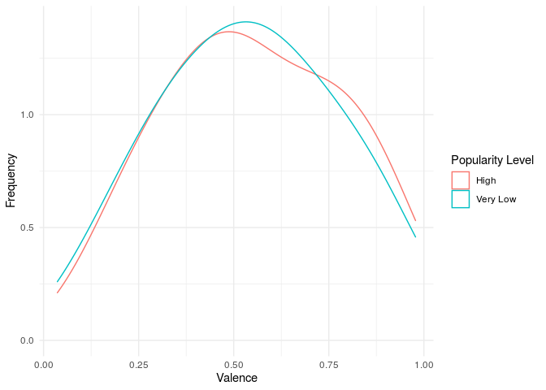<!-- -->

``` r
Spotify_rock %>%
filter(popularity_level == c("High", "Very Low")) %>%
ggplot(aes(x = danceability, color = popularity_level)) +
geom_density(adjust = 2) +
labs(x = "danceability",
y = "Frequency",
color = "Popularity Level") +
theme_minimal()
```

    ## Warning in popularity_level == c("High", "Very Low"): longer object length is
    ## not a multiple of shorter object length

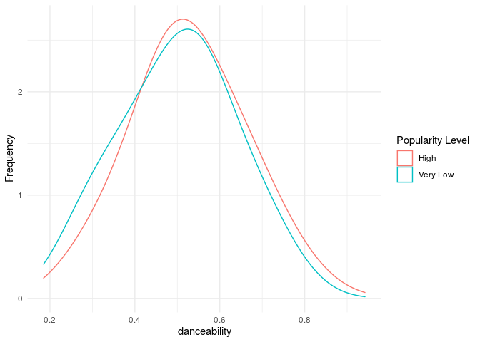<!-- -->

``` r
Spotify_rock %>%
filter(popularity_level == c("High", "Very Low")) %>%
ggplot(aes(x = tempo, color = popularity_level)) +
geom_density(adjust = 2) +
labs(x = "Tempo",
y = "Frequency",
color = "Popularity Level") +
theme_minimal()
```

    ## Warning in popularity_level == c("High", "Very Low"): longer object length is
    ## not a multiple of shorter object length

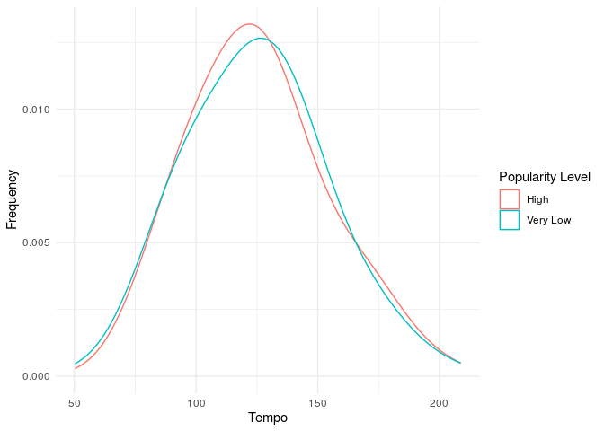<!-- -->

``` r
Spotify_rock %>%
filter(popularity_level == c("High", "Very Low")) %>%
ggplot(aes(x = acousticness, color = popularity_level)) +
geom_density(adjust = 2) +
labs(x = "Acousticness",
y = "Frequency",
color = "Popularity Level") +
theme_minimal()
```

    ## Warning in popularity_level == c("High", "Very Low"): longer object length is
    ## not a multiple of shorter object length

<!-- -->

``` r
Spotify_rock %>%
filter(popularity_level == c("High", "Very Low")) %>%
ggplot(aes(x = speechiness, color = popularity_level)) +
geom_density(adjust = 2) +
labs(x = "Speechiness",
y = "Frequency",
color = "Popularity Level") +
theme_minimal()
```

    ## Warning in popularity_level == c("High", "Very Low"): longer object length is
    ## not a multiple of shorter object length

<!-- -->

``` r
Spotify_rock %>%
filter(popularity_level == c("High", "Very Low")) %>%
ggplot(aes(x = duration_ms, color = popularity_level)) +
geom_density(adjust = 2) +
labs(x = "Duration",
y = "Frequency",
color = "Popularity Level") +
theme_minimal()
```

    ## Warning in popularity_level == c("High", "Very Low"): longer object length is
    ## not a multiple of shorter object length

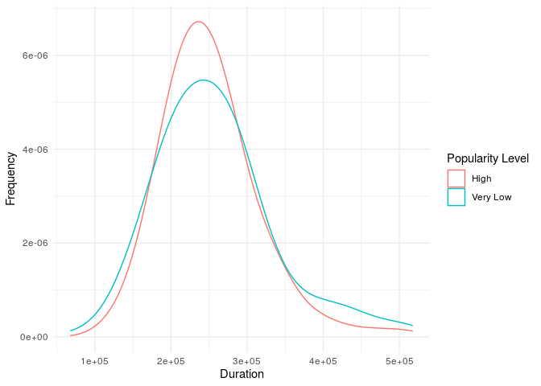<!-- -->

``` r
Spotify_rock %>%
filter(popularity_level == c("High", "Very Low")) %>%
ggplot(aes(x = energy, color = popularity_level)) +
geom_density(adjust = 2) +
labs(x = "Energy",
y = "Frequency",
color = "Popularity Level") +
theme_minimal()
```

    ## Warning in popularity_level == c("High", "Very Low"): longer object length is
    ## not a multiple of shorter object length

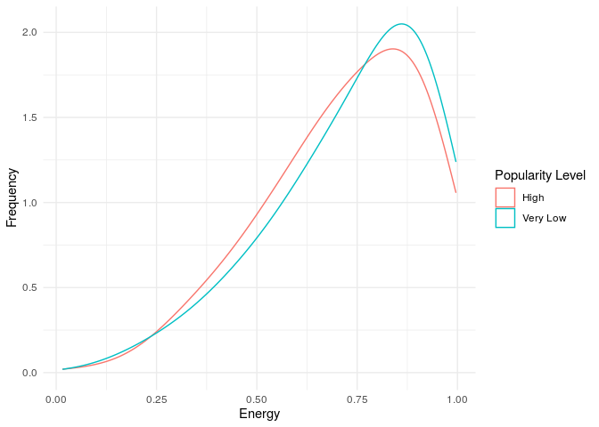<!-- -->

``` r
Spotify_rock %>%
filter(popularity_level == c("High", "Very Low")) %>%
ggplot(aes(x = key, color = popularity_level)) +
geom_density(adjust = 2) +
labs(x = "Key",
y = "Frequency",
color = "Popularity Level") +
theme_minimal()
```

    ## Warning in popularity_level == c("High", "Very Low"): longer object length is
    ## not a multiple of shorter object length

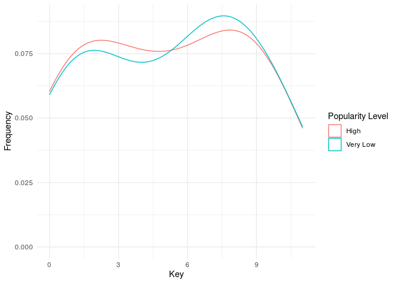<!-- -->

``` r
Spotify_rock_pop <- Spotify%>%
  filter(playlist_genre=="rock")%>%
  filter(track_popularity>63)%>%
  view()
```

``` r
Spotify_rock %>%
  
  count(key, sort = TRUE)%>%
  slice_max(n,n=5) %>%
  arrange(key,n)
```

    ## # A tibble: 5 x 2
    ##     key     n
    ##   <dbl> <int>
    ## 1     0   622
    ## 2     2   656
    ## 3     4   474
    ## 4     7   608
    ## 5     9   651

c = 0, c\# = 1, d = 2, d\# = 3,E = 4, F = 5, F\# = 6, G = 7, G\# = 8, A
= 9, A\# = 10, B = 11

``` r
Spotify_rock %>%
  filter(mode=="0")%>%
  group_by(key)%>%
  ggplot(aes(x=key,y=track_popularity, color=key, fill=key))+
  geom_col()
```

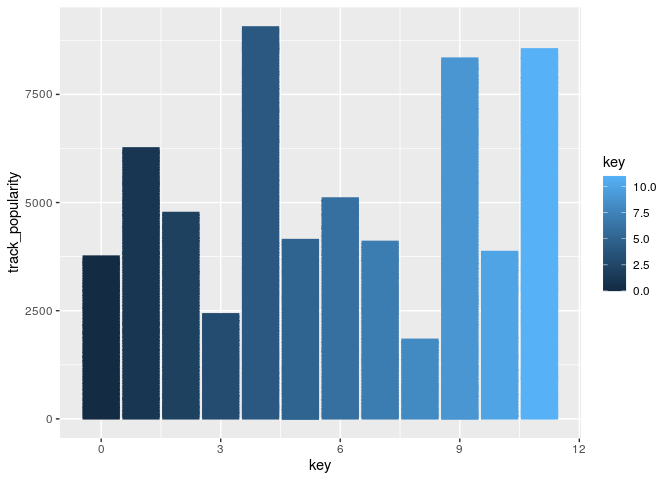<!-- -->

``` r
Spotify_rock %>%
  filter(mode=="1")%>%
  group_by(key)%>%
  ggplot(aes(x=key, y=track_popularity, color=key, fill=key))+
  geom_col()
```

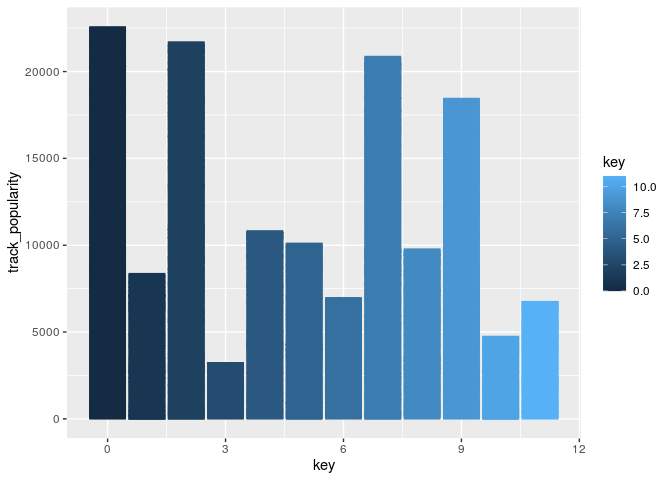<!-- -->

``` r
Spotify_rock_pop %>%
  filter(mode=="0")%>%
  group_by(key)%>%
  ggplot(aes(x=key,y=track_popularity, color=key, fill=key))+
  geom_col()
```

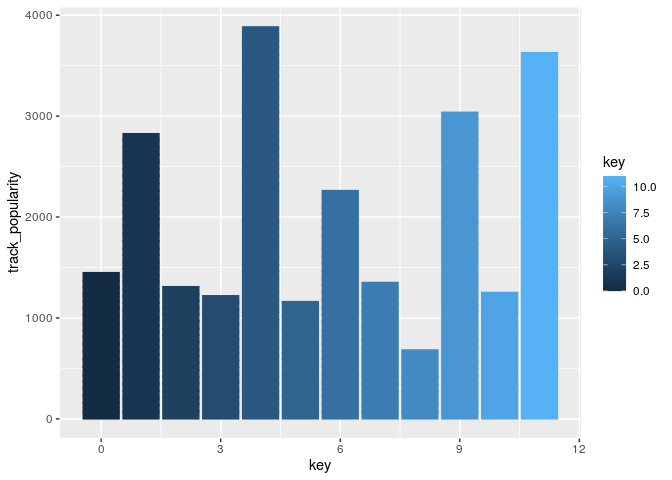<!-- -->

``` r
Spotify_rock_pop %>%
  filter(mode=="1")%>%
  group_by(key)%>%
  ggplot(aes(x=key,y=track_popularity, color=key, fill=key))+
  geom_col()
```

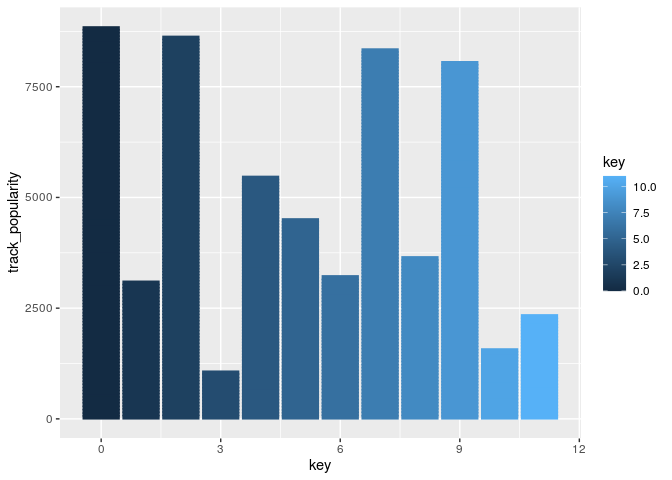<!-- -->

``` r
Spotify_rock_pop%>%
  
  ggplot(aes(x=key))+
  geom_histogram(binwidth = 0.5)
```

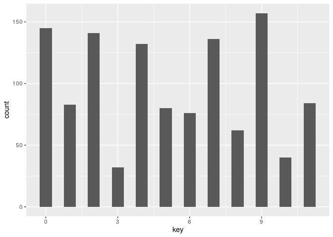<!-- -->

``` r
Spotify_rock%>%
  ggplot(aes(x=tempo, y=energy, colour=mode))+
  geom_point()+
  geom_smooth()
```

    ## `geom_smooth()` using method = 'gam' and formula 'y ~ s(x, bs = "cs")'

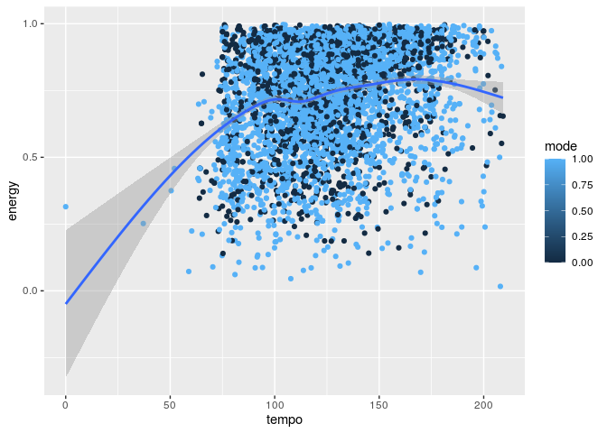<!-- -->

``` r
Spotify_rock_pop%>%
  ggplot(aes(x=danceability, y=valence, colour=mode))+
  geom_point()
```

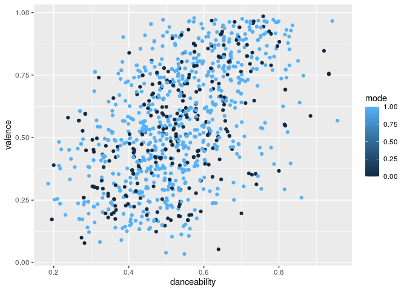<!-- -->

``` r
Spotify_rock_pop%>%
  ggplot(aes(y=track_popularity,x=valence, colour=mode))+
  geom_point()
```

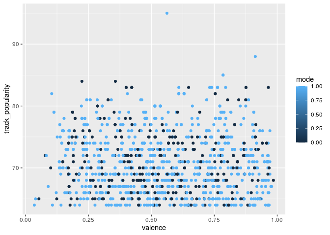<!-- -->
