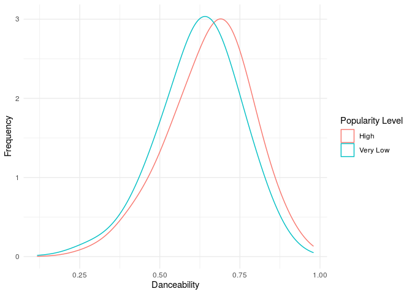

Exploring the Factors of Song Popularity
================
by Louhavidandros

# Summary

We chose to use the `spotify_songs` which gets its data from the
`spotifyr`package, whose data comes from Spotify. The data set contains
32833 observations each of which is a song, and 23 variables, which
range from information about the song such as name, artist and genre as
well as a number of numerical variables which each look at aspects of
the songs character such as its energy, its danceability or its
popularity. Our goal was to explore every genre of music in the data set
and see for each genre how the numerical variables affected a song’s
popularity; once we had this we then wanted to compare this across the
genres to see whether they had different factors that contributed to
making songs popular.

Prior to conducting any analysis the data set was cleaned as best we
could by filtering for each genre and removing all repeated songs (there
were just shy of 5000 songs which appeared in more than one playlist in
a given genre). This way songs could appear multiple times if their
genre is ambiguous, but repeats will not impact the analysis of one
genre by itself.

To begin with, we did some very general analysis and looked at which
genres and subgenres of music were the most popular overall, we then
decided to do a genre by genre analysis of each variable by creating
scatter plots with a `geom_smooth` line, as well as a linear model which
would use every numerical variable as an explanatory variable to try and
predict track popularity. The scatter plots were unsuccessful however,
and the linear model we produced had an R squared value of 0.09 and an
rmse value of 22.5 which are clearly undesirable values when searching
for a correlation.

## Density and Ridge Plots

Consequently, we changed the way we were approaching the problem. To
begin with, we created a new variable - `popularity_level` - by
categorising song’s popularity as high, fairly high, low and very low
based on which quartile they fell into. This was done separately for
each genre, this way there was a roughly even number of songs in each
popularity level in each genre. For every genre we then looked at only
the “High” and “Very Low” brackets of popularity, and for each variable
we created a density plot that showed what values were most frequent in
each popularity level. For example:

<!-- -->

This graph shows the distribution of danceability levels of pop songs in
the highest and lowest popularity brackets. The range of values where
the red line is higher than the blue was defined as the optimal range
for song popularity, as this is where if you picked a pop song at random
you would have a higher chance of it being very popular than being very
unpopular.

These density graphs were made for every variable for each genre and
once these were created and we found which variables had interesting
information, we used ridge plots to be able to compare the distributions
across genres. For example:

    ## Warning in popularity_level == c("High", "Very Low"): longer object length is
    ## not a multiple of shorter object length
    
    ## Warning in popularity_level == c("High", "Very Low"): longer object length is
    ## not a multiple of shorter object length

<!-- -->

Not only do we gather that on average rock is the least danceable, but
we can also see the variation in the optimal range for each genre; in
all genres except edm, there is a threshold above which you are in the
optimal range for danceability. This threshold is highest in R\&B,
however there is another optimal range which is at a much lower value
but has a greater likelihood of a song being popular. In rap, pop, latin
and rock however a higher danceability will result in a higher
likelihood of a song being popular. In EDM, danceability has a
negligible effect on the likelihood of a song being popular. These
graphs were made for every variable which showed useful information.

## Multiple Variable Analysis

After having looked at individual variables, we explored a combination
of variables. The combination of danceability, valence and energy into
one variable shows some interesting results when genres are split into
popularity levels. In this case the 3 variables were multiplied together
to return a variable that measures how happy, danceable and energetic a
song is. As shown in graphs, the songs in the “High” bracket for
popularity also had the highest value for this new variable in 4 out of
the 6 genres. The 2 genres in which “High” wasn’t were R\&B and Latin;
for Latin however it was a very close second and while the “High” group
came last in R\&B, this can be explained by the nature of R\&B as a
genre. In summary while this doesn’t explicitly show that the more
danceable, energetic and happy the song is the more likely it is to be
popular, it does show that popular songs in general, throughout most
genres, are more danceable, energetic and happy.

## Changes in Trends Over Time

Finally we decided to explore how the trends of popular songs have
changed over time. Models were fitted to predict each numeric variable
using the song release date as the explanatory variable to see whether
there was any relationship between when a song was released and the
level of a certain variable it had.

Write-up of your project and findings go here. Think of this as the text
of your presentation. The length should be roughly 5 minutes when read
out loud. Although pacing varies, a 5-minute speech is roughly 750
words. To use the word count addin, select the text you want to count
the words of (probably this is the Summary section of this document, go
to Addins, and select the `Word count` addin). This addin counts words
using two different algorithms, but the results should be similar and as
long as you’re in the ballpark of 750 words, you’re good\! The addin
will ignore code chunks and only count the words in prose.

You can also load your data here and present any analysis results /
plots, but I strongly urge you to keep that to a minimum (maybe only the
most important graphic, if you have one you can choose). And make sure
to hide your code with `echo = FALSE` unless the point you are trying to
make is about the code itself. Your results with proper output and
graphics go in your presentation, this space is for a brief summary of
your project.

## Presentation

Our presentation can be found [here](presentation/presentation.html).

## Data

Include a citation for your data here. See
<http://libraryguides.vu.edu.au/c.php?g=386501&p=4347840> for guidance
on proper citation for datasets. If you got your data off the web, make
sure to note the retrieval date.

## References

List any references here. You should, at a minimum, list your data
source.
