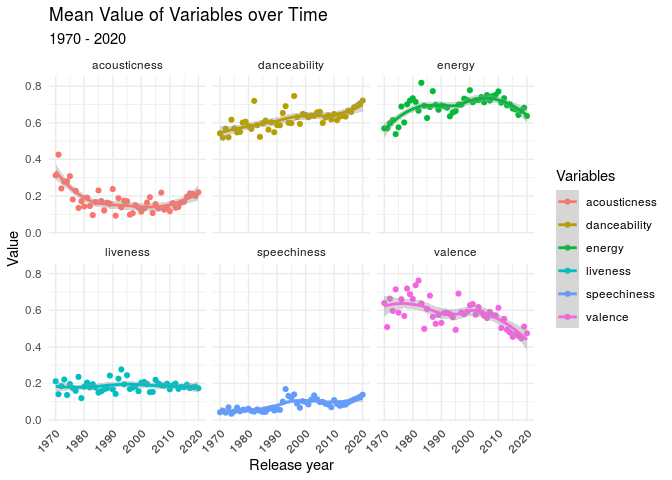

Exploring the Factors of Song Popularity
================
by Louhavidandros

# Summary

We chose to use the `spotify_songs`dataset. variables, which range from
information about the song such as name, as well as numerical variables
which look at aspects of the songs character such as its energy. Our
goal was to explore every genre of music and see how the numerical
variables affected a song’s popularity. We then wanted to compare this
across genres to see whether they had different contributing factors .
Finally we looked at how the characteristics of popular songs have
changed over time, and predicted what characteristics a popular song
released next year might have.

Firstly, the data set was cleaned by filtering for each genre and
removing all repeated songs. We did a genre-by-genre analysis of each
variable by creating scatter plots with a `geom_smooth` line, as well as
a linear model which would use every numerical variable as an
explanatory variable to try and predict track popularity. The scatter
plots were unsuccessful, and the linear model was not reliable enough
for consideration.

## Density and Ridge Plots

Consequently, we created a new variable - `popularity_level` - by
categorising song’s popularity based on which quartile they fell into.
This was done separately for each genre, this way there was a roughly
even number of songs in each popularity level in each genre. For every
genre we then looked at only the “High” and “Very Low” brackets of
popularity, and for each variable we created a density plot.

<!-- -->

This shows the distribution of danceability levels of pop songs in the
highest and lowest popularity brackets. The range of values where the
red line is higher than the blue was defined as the optimal range for
song popularity, as this is where if you picked a pop song at random you
would have a higher chance of it being very popular than being very
unpopular.

Ridge plots were made for every variable so that comparisons could be
made:

<!-- -->

Rock is on average the least danceable as its distribution is furthest
left. Danceability has a negligible effect on the likelihood of
popularity for EDM music, and only a small effect for R\&B. For pop, rap
and latin and rock, a high danceability leads to a higher likelihood of
a song being popular.

These graphs were made for every variable which showed useful
information.

## Multiple Variable Analysis

After having looked at individual variables, we explored a combination
of variables - danceability, energy and valence:

<!-- -->

<!-- -->

As shown in graphs, the songs in the “High” bracket for popularity also
had the highest value for this new variable in 4 out of the 6 genres.
The 2 genres in which “High” wasn’t were R\&B and Latin; for Latin
however it was a very close second. This shows that popular songs in
general, throughout most genres, are more danceable, energetic and
happy.

## Changes in Trends Over Time

<!-- -->

Our exploration of changes in trends over time led us to create models
which predict the mean of each numeric variable using the release year
as the explanatory. When we plotted the data, we saw patterns emerge
which we could then use to predict the characteristics of next years
songs.

## Conclusion

Whilst we did not achieve our goal by the expected means, we
successfully identified many characteristics which would give a song the
highest likelihood of it being popular, which are outlined in our
presentation.

<table>

<thead>

<tr>

<th style="text-align:right;">

acousticness

</th>

<th style="text-align:right;">

danceability

</th>

<th style="text-align:right;">

energy

</th>

<th style="text-align:right;">

instrumentalness

</th>

<th style="text-align:right;">

liveness

</th>

<th style="text-align:right;">

valence

</th>

</tr>

</thead>

<tbody>

<tr>

<td style="text-align:right;">

0.0874

</td>

<td style="text-align:right;">

0.6767

</td>

<td style="text-align:right;">

0.7331

</td>

<td style="text-align:right;">

0.0097

</td>

<td style="text-align:right;">

0.1967

</td>

<td style="text-align:right;">

0.8828

</td>

</tr>

</tbody>

</table>

## Evaluation

We did our best to make the data set as appropriate as possible, however
there were a few problems with our data set which we could not change
and that may have lead to inaccuracies in our result:

The dataset contained roughly 28,000 songs, a small fraction of the
songs released in the past 50 years.

Old songs released long before Spotify was released have their
popularity judged by modern standards rather than the standards of their
time.

The data categorized a song’s genre based on the genre of the playlist
it was in which lead to some song’s genres being mislabeled.

## Presentation

Our presentation can be found [here](presentation/presentation.html).

## Data

Thompson, C, Parry, J, Phipps, D, Wolff, T 2020, Spotify Songs,
electronic dataset, R for Data Science Online Learning Community/
TidyTuesday, viewed 2 November 2020,
<https://github.com/rfordatascience/tidytuesday/blob/master/data/2020/2020-01-21/readme.md>

## References

Thompson, C, Parry, J, Phipps, D, Wolff, T 2020, Spotify Songs,
electronic dataset, R for Data Science Online Learning Community/
TidyTuesday, viewed 2 November 2020,
<https://github.com/rfordatascience/tidytuesday/blob/master/data/2020/2020-01-21/readme.md>
