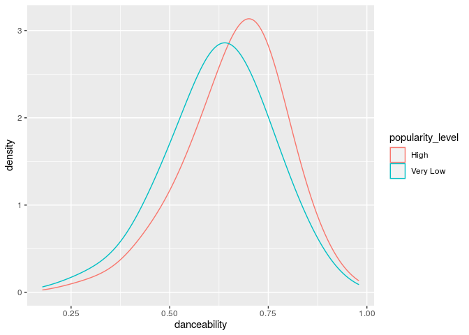
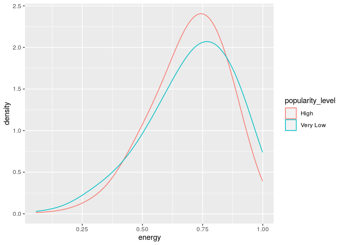
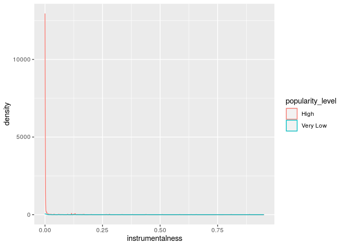
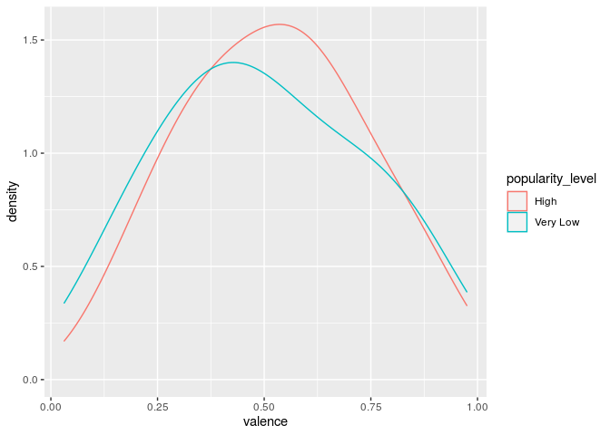
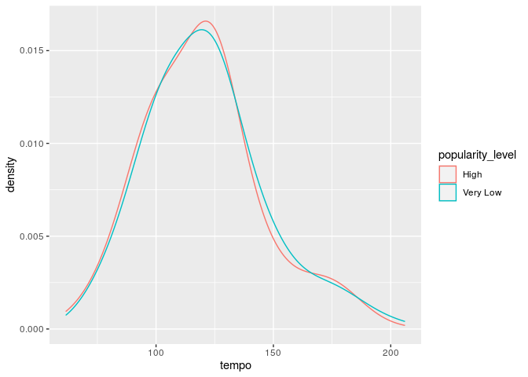
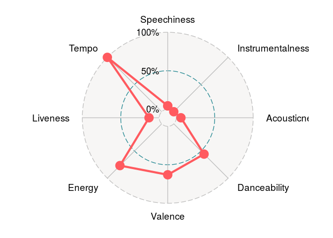
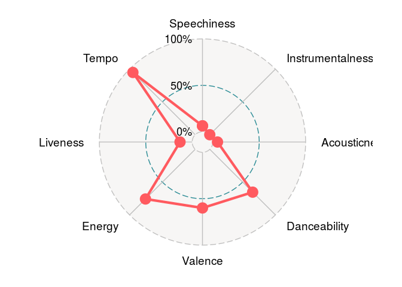
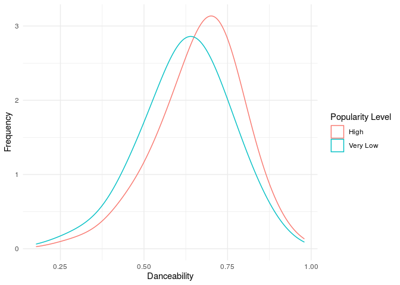
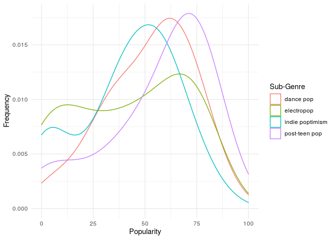
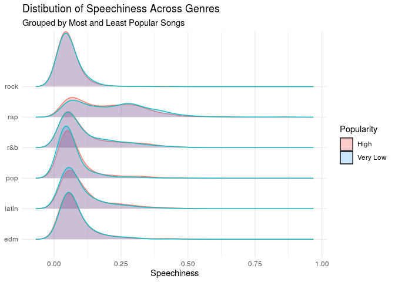

David’s Ideas
================

``` r
spotify_songs <- read_csv(here::here("data/Spotify.csv"))
```

    ## Parsed with column specification:
    ## cols(
    ##   .default = col_double(),
    ##   track_id = col_character(),
    ##   track_name = col_character(),
    ##   track_artist = col_character(),
    ##   track_album_id = col_character(),
    ##   track_album_name = col_character(),
    ##   track_album_release_date = col_character(),
    ##   playlist_name = col_character(),
    ##   playlist_id = col_character(),
    ##   playlist_genre = col_character(),
    ##   playlist_subgenre = col_character()
    ## )

    ## See spec(...) for full column specifications.

``` r
pop_songs <- spotify_songs %>%
  filter(playlist_genre == "pop")
```

### Popularity Level

``` r
pop_songs <- pop_songs %>%
  filter(playlist_genre == "pop") %>%
  mutate(popularity_level = case_when(
    track_popularity <= 31 ~ "Very Low",
    track_popularity > 31 & track_popularity <= 52 ~ "Low",
    track_popularity > 52 & track_popularity < 68 ~ "Fairly High",
    track_popularity >= 68 & track_popularity <= 100 ~ "High"
  ))
```

``` r
edm_songs <- spotify_songs %>%
  filter(playlist_genre == "edm") %>%
  mutate(popularity_level = case_when(
    track_popularity <= 17 ~ "Very Low",
    track_popularity > 17 & track_popularity <= 36 ~ "Low",
    track_popularity > 36 & track_popularity < 51 ~ "Fairly High",
    track_popularity >= 51 & track_popularity <= 100 ~ "High"
  )) 
```

``` r
latin_songs <- spotify_songs %>%
  filter(playlist_genre == "latin") %>%
  mutate(popularity_level = case_when(
    track_popularity <= 32 ~ "Very Low",
    track_popularity > 32 & track_popularity <= 50 ~ "Low",
    track_popularity > 50 & track_popularity < 67 ~ "Fairly High",
    track_popularity >= 67 & track_popularity <= 100 ~ "High"
  ))
```

``` r
rnb_songs <- spotify_songs %>%
  filter(playlist_genre == "r&b") %>%
  mutate(popularity_level = case_when(
    track_popularity <= 20 ~ "Very Low",
    track_popularity > 20 & track_popularity <= 44 ~ "Low",
    track_popularity > 44 & track_popularity < 62 ~ "Fairly High",
    track_popularity >= 62 & track_popularity <= 100 ~ "High"
  ))
```

``` r
rap_songs <- spotify_songs %>%
  filter(playlist_genre == "rap") %>%
  mutate(popularity_level = case_when(
    track_popularity <= 30 ~ "Very Low",
    track_popularity > 30 & track_popularity <= 47 ~ "Low",
    track_popularity > 47 & track_popularity < 60 ~ "Fairly High",
    track_popularity >= 60 & track_popularity <= 100 ~ "High"
  )) 
```

``` r
rock_songs <- spotify_songs %>%
  filter(playlist_genre == "rock") %>%
  mutate(popularity_level = case_when(
    track_popularity <= 21 ~ "Very Low",
    track_popularity > 21 & track_popularity <= 46 ~ "Low",
    track_popularity > 46 & track_popularity < 63 ~ "Fairly High",
    track_popularity >= 63 & track_popularity <= 100 ~ "High"
  )) 
```

### Combined Data Set

``` r
all_songs <- pop_songs %>%
  rbind(pop_songs, rock_songs, latin_songs, edm_songs, rap_songs, rnb_songs)
```

### General Summary

``` r
pop_songs %>%
  summarise(min_pop = min(track_popularity), iqr_pop = IQR(track_popularity), med_pop = median(track_popularity), max_pop = max(track_popularity), quantile(track_popularity))
```

    ## # A tibble: 5 x 5
    ##   min_pop iqr_pop med_pop max_pop `quantile(track_popularity)`
    ##     <dbl>   <dbl>   <dbl>   <dbl>                        <dbl>
    ## 1       0      37      52     100                            0
    ## 2       0      37      52     100                           31
    ## 3       0      37      52     100                           52
    ## 4       0      37      52     100                           68
    ## 5       0      37      52     100                          100

### Median Values

``` r
pop_songs %>%
  filter(popularity_level == c("High", "Very Low")) %>%
  group_by(popularity_level) %>%
  summarise(med_dance = median(danceability),
            med_energy = median(energy),
            med_tempo = median(tempo),
            med_duration_s = median(duration_ms)/1000,
            med_speech = median(speechiness),
            med_acoustic = median(acousticness)) 
```

    ## Warning in popularity_level == c("High", "Very Low"): longer object length is
    ## not a multiple of shorter object length

    ## `summarise()` ungrouping output (override with `.groups` argument)

    ## # A tibble: 2 x 7
    ##   popularity_level med_dance med_energy med_tempo med_duration_s med_speech
    ##   <chr>                <dbl>      <dbl>     <dbl>          <dbl>      <dbl>
    ## 1 High                 0.682      0.710      120.           209.     0.0542
    ## 2 Very Low             0.632      0.732      120.           219.     0.046 
    ## # … with 1 more variable: med_acoustic <dbl>

### Statistics

``` r
pop_songs %>%
  group_by(popularity_level) %>%
  summarise(min_dance = min(danceability), med_dance = median(danceability), max_dance = max(danceability), min_energy = min(energy), med_energy = median(energy), max_energy = max(energy))
```

    ## `summarise()` ungrouping output (override with `.groups` argument)

    ## # A tibble: 4 x 7
    ##   popularity_level min_dance med_dance max_dance min_energy med_energy
    ##   <chr>                <dbl>     <dbl>     <dbl>      <dbl>      <dbl>
    ## 1 Fairly High         0.244      0.648     0.95     0.0436       0.738
    ## 2 High                0.209      0.672     0.979    0.0581       0.711
    ## 3 Low                 0.0985     0.646     0.963    0.00814      0.720
    ## 4 Very Low            0.118      0.636     0.945    0.0692       0.741
    ## # … with 1 more variable: max_energy <dbl>

``` r
pop_songs %>%
  group_by(popularity_level) %>%
  summarise(min_duration_ms = min(duration_ms), med_duration_ms = median(duration_ms), max_duration_ms = max(duration_ms), min_acousticness = min(acousticness), med_acousticness = median(acousticness), max_acousticness = max(acousticness))
```

    ## `summarise()` ungrouping output (override with `.groups` argument)

    ## # A tibble: 4 x 7
    ##   popularity_level min_duration_ms med_duration_ms max_duration_ms
    ##   <chr>                      <dbl>           <dbl>           <dbl>
    ## 1 Fairly High               108125         208421           468587
    ## 2 High                       80407         209880           484147
    ## 3 Low                        37640         206788.          474333
    ## 4 Very Low                   61385         218786.          490057
    ## # … with 3 more variables: min_acousticness <dbl>, med_acousticness <dbl>,
    ## #   max_acousticness <dbl>

``` r
pop_songs %>%
  group_by(popularity_level) %>%
  summarise(min_speechiness = min(speechiness), med_speechiness = median(speechiness), max_speechiness = max(speechiness), min_instrumentalness = min(instrumentalness), med_instrumentalness = median(instrumentalness), max_instrumentalness = max(instrumentalness))
```

    ## `summarise()` ungrouping output (override with `.groups` argument)

    ## # A tibble: 4 x 7
    ##   popularity_level min_speechiness med_speechiness max_speechiness
    ##   <chr>                      <dbl>           <dbl>           <dbl>
    ## 1 Fairly High               0.0228          0.0490           0.869
    ## 2 High                      0.0243          0.0536           0.486
    ## 3 Low                       0.0235          0.0487           0.558
    ## 4 Very Low                  0.0228          0.0455           0.558
    ## # … with 3 more variables: min_instrumentalness <dbl>,
    ## #   med_instrumentalness <dbl>, max_instrumentalness <dbl>

``` r
pop_songs %>%
  group_by(popularity_level) %>%
  summarise(min_tempo = min(tempo), med_tempo = median(tempo), max_tempo = max(tempo))
```

    ## `summarise()` ungrouping output (override with `.groups` argument)

    ## # A tibble: 4 x 4
    ##   popularity_level min_tempo med_tempo max_tempo
    ##   <chr>                <dbl>     <dbl>     <dbl>
    ## 1 Fairly High           60.4      120.      212.
    ## 2 High                  61.7      120.      205.
    ## 3 Low                   68.4      120.      206.
    ## 4 Very Low              35.5      121.      206.

### Key Popularity

``` r
pop_songs %>%
  filter(mode == "1") %>%
  ggplot(aes(x = key)) +
  geom_histogram() +
  facet_wrap(~popularity_level)
```

    ## `stat_bin()` using `bins = 30`. Pick better value with `binwidth`.

<!-- -->

``` r
pop_songs %>%
  filter(mode == "0") %>%
  ggplot(aes(x = key)) +
  geom_histogram() +
  facet_wrap(~popularity_level)
```

    ## `stat_bin()` using `bins = 30`. Pick better value with `binwidth`.

<!-- -->

The most common key for a popular pop song with a major key is C\#
major, followed by C major and then by F\# major, whilst the most common
keys for an unpopular pop song with a major key are C major then D major
and then F\# major. Eb major is the least frequent in both popular and
unpopular songs, though it is used slighlt more in unpopular songs.

The most common key for a popular pop song with a minor key is C\#
Minor, followed by B minor and F minor, whilst the most common keys for
unpopular pop songs with a minor key are B minor, then A minor and then
C\# minor

``` r
major_key_popularity <-pop_songs %>%
  filter(mode == "1") %>%
  group_by(popularity_level, key) %>%
  count(key)
```

``` r
minor_key_popularity <- pop_songs %>%
  filter(mode == "0") %>%
  group_by(popularity_level, key) %>%
  count(key)
```

### Most Pop vs Least Pop

``` r
pop_songs %>%
  filter(popularity_level == c("High", "Very Low")) %>%
  ggplot(aes(x = acousticness, color = popularity_level)) +
  geom_density(adjust = 2)
```

    ## Warning in popularity_level == c("High", "Very Low"): longer object length is
    ## not a multiple of shorter object length

<!-- -->

BETWEEN X AND Y MORE LIKELY TO BE V POP THAN V UNPOP

``` r
pop_songs %>%
  filter(popularity_level == c("High", "Very Low")) %>%
  ggplot(aes(x = danceability, color = popularity_level)) +
  geom_density(adjust = 2)
```

    ## Warning in popularity_level == c("High", "Very Low"): longer object length is
    ## not a multiple of shorter object length

<!-- -->

DANCEABILITY IS GOOD

``` r
pop_songs %>%
  filter(popularity_level == c("High", "Very Low")) %>%
  ggplot(aes(x = energy, color = popularity_level)) +
  geom_density(adjust = 2)
```

    ## Warning in popularity_level == c("High", "Very Low"): longer object length is
    ## not a multiple of shorter object length

<!-- -->

ENERGY DECENT

``` r
pop_songs %>%
  filter(popularity_level == c("High", "Very Low")) %>%
  ggplot(aes(x = loudness, color = popularity_level)) +
  geom_density(adjust = 2)
```

    ## Warning in popularity_level == c("High", "Very Low"): longer object length is
    ## not a multiple of shorter object length

<!-- -->

LOUDNESS ALRIGHT - ABOVE X MORE LIKELY TO BE POP

``` r
pop_songs %>%
  filter(popularity_level == c("High", "Very Low")) %>%
  ggplot(aes(x = speechiness, color = popularity_level)) +
  geom_density(adjust = 2)
```

    ## Warning in popularity_level == c("High", "Very Low"): longer object length is
    ## not a multiple of shorter object length

<!-- -->

MEH

``` r
pop_songs %>%
  filter(popularity_level == c("High", "Very Low")) %>%
  ggplot(aes(x = instrumentalness, color = popularity_level)) +
  geom_density(adjust = 2)
```

    ## Warning in popularity_level == c("High", "Very Low"): longer object length is
    ## not a multiple of shorter object length

<!-- -->

WACK

``` r
pop_songs %>%
  filter(playlist_genre == "pop",
         popularity_level == c("High", "Very Low")) %>%
  ggplot(aes(x = liveness, color = popularity_level)) +
  geom_density(adjust = 2)
```

    ## Warning in popularity_level == c("High", "Very Low"): longer object length is
    ## not a multiple of shorter object length

<!-- -->

``` r
pop_songs %>%
  filter(popularity_level == c("High", "Very Low")) %>%
  ggplot(aes(x = valence, color = popularity_level)) +
  geom_density(adjust = 2)
```

    ## Warning in popularity_level == c("High", "Very Low"): longer object length is
    ## not a multiple of shorter object length

<!-- -->

VALENCE USEFUL

``` r
pop_songs %>%
  filter(popularity_level == c("High", "Very Low")) %>%
  ggplot(aes(x = tempo, color = popularity_level)) +
  geom_density(adjust = 2)
```

    ## Warning in popularity_level == c("High", "Very Low"): longer object length is
    ## not a multiple of shorter object length

<!-- -->

``` r
pop_songs %>%
  filter(popularity_level == c("High", "Very Low")) %>%
  ggplot(aes(x = duration_ms, color = popularity_level)) +
  geom_density(adjust = 2)
```

    ## Warning in popularity_level == c("High", "Very Low"): longer object length is
    ## not a multiple of shorter object length

<!-- -->

DURATION ALRIGHT

### New Analysis

``` r
pop_songs %>%
  group_by(playlist_subgenre) %>%
  ggplot(aes(x = track_popularity, color = playlist_subgenre)) +
  geom_density(adjust = 2)
```

<!-- -->

1.  Post Teen
2.  Dance Pop
3.  Electropop
4.  Indie

<!-- end list -->

``` r
pop_popular <- pop_songs %>%
  group_by(track_artist) %>%
  summarise(med_pop = median(track_popularity)) %>%
  arrange(desc(med_pop))
```

    ## `summarise()` ungrouping output (override with `.groups` argument)

``` r
pop_songs_artists <- pop_songs %>% 
  mutate(top_ten_artists = case_when(
    track_artist == c("The Chainsmokers",
    "David Guetta",
    "Javiera Mena",
    "Calvin Harris", 
    "Kygo", 
    "Avicii", 
    "Ariana Grande", 
    "Katy Perry", 
    "Maroon 5", 
    "Martin Garrix") ~"Pop Ten",
    TRUE ~ "Not Pop Ten"
  ))
```

    ## Warning: Problem with `mutate()` input `top_ten_artists`.
    ## ℹ longer object length is not a multiple of shorter object length
    ## ℹ Input `top_ten_artists` is `case_when(...)`.

    ## Warning in track_artist == c("The Chainsmokers", "David Guetta", "Javiera
    ## Mena", : longer object length is not a multiple of shorter object length

``` r
pop_ten_results <- pop_songs_artists %>%
  filter(top_ten_artists == "Pop Ten") %>%
  group_by(track_artist) %>%
  summarise(med_speechiness = median(speechiness), med_instrumentalness = median(instrumentalness), med_duration_ms = median(duration_ms), med_danceability = median(danceability), med_valence = median(valence), med_energy = median(energy), med_tempo = median(tempo), med_loudness = median(loudness), med_liveness = median(liveness), med_acousticness = median(acousticness))
```

    ## `summarise()` ungrouping output (override with `.groups` argument)

### Most Common Artists and Their Song Choices

### Decade by Decade Overview

``` r
all_songs <- all_songs %>%
  mutate(decade = str_sub(track_album_release_date, 3,3))
```

``` r
all_songs <- all_songs %>%
mutate(decade = case_when(
    decade == "5" ~ "1950's",
    decade == "6" ~ "1960's",
    decade == "7" ~ "1970's",
    decade == "8" ~ "1980's",
    decade == "9" ~ "1990's",
    decade == "0" ~ "2000's",
    decade == "1" ~ "2010's",
    decade == "2" ~ "2020's"
  ))
```

``` r
time_trends <- all_songs %>%
  filter(popularity_level == "High") %>%
  group_by(decade) %>%
  summarise(med_speechiness = median(speechiness), med_instrumentalness = median(instrumentalness), med_duration_ms = median(duration_ms), med_danceability = median(danceability), med_valence = median(valence), med_energy = median(energy), med_tempo = median(tempo), med_loudness = median(loudness), med_liveness = median(liveness), med_acousticness = median(acousticness))
```

    ## `summarise()` ungrouping output (override with `.groups` argument)

``` r
time_trends <- time_trends %>%
  mutate(tempo = med_tempo/124.326,
         speechiness = med_speechiness/0.0737,
         instrumentalness = med_instrumentalness/3.19e-04,
         acousticness = med_acousticness/0.2626,
         danceability = med_danceability/0.709,
         valence = med_valence/0.660,
         energy = med_energy/0.769,
         liveness = med_liveness/0.138)
```

### Changing of Trends Over Time

``` r
time_trends %>%
  filter(decade == "1960's") %>%
  select(med_tempo, med_speechiness, med_instrumentalness, med_acousticness, med_danceability, med_valence, med_energy, med_liveness, tempo) %>%
  ggradar(axis.labels = c("Speechiness", "Instrumentalness", "Acousticness", "Danceability","Valence", "Energy", "Liveness", "Tempo")) 
```

<!-- -->

``` r
time_trends %>%
  filter(decade == "1970's") %>%
  select(med_tempo, med_speechiness, med_instrumentalness, med_acousticness, med_danceability, med_valence, med_energy, med_liveness, tempo) %>%
  ggradar(axis.labels = c("Speechiness", "Instrumentalness", "Acousticness", "Danceability","Valence", "Energy", "Liveness", "Tempo"))
```

<!-- -->

``` r
time_trends %>%
  filter(decade == "1980's") %>%
  select(med_tempo, med_speechiness, med_instrumentalness, med_acousticness, med_danceability, med_valence, med_energy, med_liveness, tempo) %>%
  ggradar(axis.labels = c("Speechiness", "Instrumentalness", "Acousticness", "Danceability","Valence", "Energy", "Liveness", "Tempo"))
```

<!-- -->

``` r
time_trends %>%
  filter(decade == "1990's") %>%
  select(med_tempo, med_speechiness, med_instrumentalness, med_acousticness, med_danceability, med_valence, med_energy, med_liveness, tempo) %>%
  ggradar(axis.labels = c("Speechiness", "Instrumentalness", "Acousticness", "Danceability","Valence", "Energy", "Liveness", "Tempo"))
```

<!-- -->

``` r
time_trends %>%
  filter(decade == "2000's") %>%
  select(med_tempo, med_speechiness, med_instrumentalness, med_acousticness, med_danceability, med_valence, med_energy, med_liveness, tempo) %>%
  ggradar(axis.labels = c("Speechiness", "Instrumentalness", "Acousticness", "Danceability","Valence", "Energy", "Liveness", "Tempo"))
```

<!-- -->

``` r
time_trends %>%
  filter(decade == "2010's") %>%
  select(med_tempo, med_speechiness, med_instrumentalness, med_acousticness, med_danceability, med_valence, med_energy, med_liveness, tempo) %>%
  ggradar(axis.labels = c("Speechiness", "Instrumentalness", "Acousticness", "Danceability","Valence", "Energy", "Liveness", "Tempo"))
```

<!-- -->

``` r
time_trends %>%
  filter(decade == "2020's") %>%
  select(med_tempo, med_speechiness, med_instrumentalness, med_acousticness, med_danceability, med_valence, med_energy, med_liveness, tempo) %>%
  ggradar(axis.labels = c("Speechiness", "Instrumentalness", "Acousticness", "Danceability","Valence", "Energy", "Liveness", "Tempo"))
```

<!-- -->

### Adjusted Radar Plots

``` r
time_trends %>%
  filter(decade == "1960's") %>%
  select(med_tempo, speechiness, instrumentalness, acousticness, danceability, valence, energy, liveness, tempo) %>%
  ggradar(axis.labels = c("Speechiness", "Instrumentalness", "Acousticness", "Danceability","Valence", "Energy", "Liveness", "Tempo"))
```

<!-- -->

``` r
time_trends %>%
  filter(decade == "1970's") %>%
  select(med_tempo, speechiness, instrumentalness, acousticness, danceability, valence, energy, liveness, tempo) %>%
  ggradar(axis.labels = c("Speechiness", "Instrumentalness", "Acousticness", "Danceability","Valence", "Energy", "Liveness", "Tempo"))
```

<!-- -->

``` r
time_trends %>%
  filter(decade == "1980's") %>%
  select(med_tempo, speechiness, instrumentalness, acousticness, danceability, valence, energy, liveness, tempo) %>%
  ggradar(axis.labels = c("Speechiness", "Instrumentalness", "Acousticness", "Danceability","Valence", "Energy", "Liveness", "Tempo"))
```

<!-- -->

``` r
time_trends %>%
  filter(decade == "1990's") %>%
  select(med_tempo, speechiness, instrumentalness, acousticness, danceability, valence, energy, liveness, tempo) %>%
  ggradar(axis.labels = c("Speechiness", "Instrumentalness", "Acousticness", "Danceability","Valence", "Energy", "Liveness", "Tempo"))
```

<!-- -->

``` r
time_trends %>%
  filter(decade == "2000's") %>%
  select(med_tempo, speechiness, instrumentalness, acousticness, danceability, valence, energy, liveness, tempo) %>%
  ggradar(axis.labels = c("Speechiness", "Instrumentalness", "Acousticness", "Danceability","Valence", "Energy", "Liveness", "Tempo"))
```

<!-- -->

``` r
time_trends %>%
  filter(decade == "2010's") %>%
  select(med_tempo, speechiness, instrumentalness, acousticness, danceability, valence, energy, liveness, tempo) %>%
  ggradar(axis.labels = c("Speechiness", "Instrumentalness", "Acousticness", "Danceability","Valence", "Energy", "Liveness", "Tempo"))
```

<!-- -->

``` r
time_trends %>%
  filter(decade == "2020's") %>%
  select(med_tempo, speechiness, instrumentalness, acousticness, danceability, valence, energy, liveness, tempo) %>%
  ggradar(axis.labels = c("Speechiness", "Instrumentalness", "Acousticness", "Danceability","Valence", "Energy", "Liveness", "Tempo"))
```

<!-- -->

### Artist Analysis

### Beginning of Nicely Presented Analysis

The quartile values for `track_popularity` were found and these values
were used as cut off points to define `popularity_level`, with a song
being classified as ‘very low’, ‘low’, ‘fairly high’ and ‘high’
depending on whether it was higher than any of the quartile values.

The main comparisons are made between songs which have a high popularity
level and songs which have a very low popularity level.

``` r
pop_songs %>%
  filter(popularity_level == c("High", "Very Low")) %>%
  group_by(popularity_level) %>%
  summarise(med_dance = median(danceability),
            med_energy = median(energy),
            med_tempo = median(tempo),
            med_duration_s = median(duration_ms)/1000,
            med_speech = median(speechiness),
            med_acoustic = median(acousticness),
            med_valence = median(valence)) 
```

    ## Warning in popularity_level == c("High", "Very Low"): longer object length is
    ## not a multiple of shorter object length

    ## `summarise()` ungrouping output (override with `.groups` argument)

    ## # A tibble: 2 x 8
    ##   popularity_level med_dance med_energy med_tempo med_duration_s med_speech
    ##   <chr>                <dbl>      <dbl>     <dbl>          <dbl>      <dbl>
    ## 1 High                 0.682      0.710      120.           209.     0.0542
    ## 2 Very Low             0.632      0.732      120.           219.     0.046 
    ## # … with 2 more variables: med_acoustic <dbl>, med_valence <dbl>

To begin with, the median values for a selection of variables was
compared and the following conclusions were made: On average, popular
pop songs have a higher danceability, speechiness, acousticness and
valence than unpopular pop songs, and on average a lower energy and
duration than unpopular pop songs. The average tempo for both popular
and unpopular pop songs is the same.

### Graphing Popularity Likelihood

Graphical representations then made it easier to tell whether a song was
more likely to be popular or unpopular given a certain variable:

### Danceability

``` r
pop_songs %>%
  filter(popularity_level == c("High", "Very Low")) %>%
  ggplot(aes(x = danceability, color = popularity_level)) +
  geom_density(adjust = 2) +
    labs(x = "Danceability",
       y = "Frequency",
       color = "Popularity Level") +
  theme_minimal()
```

    ## Warning in popularity_level == c("High", "Very Low"): longer object length is
    ## not a multiple of shorter object length

<!-- -->

On average, if a pop song has a danceablility over 0.66 it is more
likely to be popular than to be very unpopular. Similarly if its has a
danceability less than 0.66, it is more likely to be very unpopular than
popular.

Takeaway: Pop songs which are popular are more likely to be suitable for
dancing than pop songs which are very unpopular

### Energy

``` r
pop_songs %>%
  filter(popularity_level == c("High", "Very Low")) %>%
  ggplot(aes(x = energy, color = popularity_level)) +
  geom_density(adjust = 2) +
  labs(x = "Energy",
       y = "Frequency",
       color = "Popularity Level") +
  theme_minimal()
```

    ## Warning in popularity_level == c("High", "Very Low"): longer object length is
    ## not a multiple of shorter object length

<!-- -->

There is clearly a desirable range of energy values: a pop song with an
energy between 0.40 and 0.83 is more likely to be popular than very
unpopular, and an energy outwith these values makes a pop song more
likely to be very unpopular.

### Valence

``` r
pop_songs %>%
  filter(popularity_level == c("High", "Very Low")) %>%
  ggplot(aes(x = valence, color = popularity_level)) +
  geom_density(adjust = 2) +
    labs(x = "Valence",
       y = "Frequency",
       color = "Popularity Level") +
  theme_minimal()
```

    ## Warning in popularity_level == c("High", "Very Low"): longer object length is
    ## not a multiple of shorter object length

<!-- -->

Another optimal range can be seen with valence values: A pop song with a
valence between 0.38 and 0.82 is more likely to be popular than very
unpopular.A valence below 0.38 will give a higher likelihood of the pop
song being very unpopular, and a valence higher than 0.82 will change
the odds in very slight favour of the song being very unpopular rather
than popular.

### Acousticness

``` r
pop_songs %>%
  filter(popularity_level == c("High", "Very Low")) %>%
  ggplot(aes(x = acousticness, color = popularity_level)) +
  geom_density(adjust = 2) +
    labs(x = "Acousticness",
       y = "Frequency",
       color = "Popularity Level") +
  theme_minimal()
```

    ## Warning in popularity_level == c("High", "Very Low"): longer object length is
    ## not a multiple of shorter object length

<!-- -->

The distribution of acousticness is very similar, but for the biggest
likelihood of a pop song being popular rather than unpopular the
acousticness should be between 0.07 and 0.63, as other values result in
there being a higher likelihood of the song being very unpopular than
being popular

### Loudness

``` r
pop_songs %>%
  filter(popularity_level == c("High", "Very Low")) %>%
  ggplot(aes(x = loudness, color = popularity_level)) +
  geom_density(adjust = 2) +
    labs(x = "Loudness",
       y = "Frequency",
       color = "Popularity Level") +
  theme_minimal()
```

    ## Warning in popularity_level == c("High", "Very Low"): longer object length is
    ## not a multiple of shorter object length

<!-- -->

On average, a pop song with a loudness value higher than -7 is more
likely to be popular than very unpopular. On average, popular pop songs
are louder than very unpopular pop songs

### Duration

``` r
pop_songs %>%
  filter(popularity_level == c("High", "Very Low")) %>%
  ggplot(aes(x = duration_ms/1000, color = popularity_level)) +
  geom_density(adjust = 2) +
    labs(x = "Duration (s)",
       y = "Frequency",
       color = "Popularity Level") +
  theme_minimal()
```

    ## Warning in popularity_level == c("High", "Very Low"): longer object length is
    ## not a multiple of shorter object length

<!-- -->

On average, a pop song with a duration shorter than four minutes (240s)
has a greater chance of being popular than unpopular, and durations
above four minutes lead to a higher chance of a pop song being unpopular
than poular. However the range of durations of pop songs which have the
greatest chance of being popular is three minutes to four minutes
(180-240s).

### Sub-genre

``` r
pop_songs %>%
  group_by(playlist_subgenre) %>%
  ggplot(aes(x = track_popularity, color = playlist_subgenre)) +
  geom_density(adjust = 2) +
    labs(x = "Popularity",
       y = "Frequency",
       color = "Sub-Genre") +
  theme_minimal()
```

<!-- -->

A post-teen pop song is most likely to have a high popularity out of all
of the sub-genres included in the data. Dance pop is the next most
likely to have a high popularity, followed by electro pop and then indie
poptimism.

An electro pop song is most likely to have a very low popularity out of
all the sub-genres included in the data. Indie poptimism is the next
most likely to be very unpopular, followed by post-teen pop and dance
pop.

*DO RIDGE PLOT OF DISTRIBUTION OF EVERY VARIABLE FOR EACH GENRE*

``` r
genre_quratiles <- spotify_songs %>%
  group_by(playlist_genre) %>%
  summarise(quantile(track_popularity))
```

    ## `summarise()` regrouping output by 'playlist_genre' (override with `.groups` argument)

### Valence

``` r
all_songs %>%
  filter(popularity_level == c("High", "Very Low")) %>%
  ggplot(aes(x = valence, y = playlist_genre, fill = popularity_level, color = popularity_level)) +
   geom_density_ridges(alpha = 0.2, bandwidth = 0.085) +
  labs(x = "Valence",
       y = NULL,
       fill = "Popularity Level",
       title = "Distribution of Valence Across Genres",
       subtitle = "Grouped by Most  and Least Popular Songs in Each Genre"
       ) +
  guides(color = FALSE) +
  scale_fill_manual(values = c(
    "Very Low" = "#008dfd",
    "High" = "#fd0000"
  )) +
  theme_minimal()
```

<!-- -->

At a low valence(i.e. when a song is less cheery), the genre in which
there is the highest likelihood of a song having a high popularity is
rap, whereas edm has the highest probability of the song being very
unpopular, followed by pop.

At a high valence (i.e. a cheery song), the genre which is most likely
for the song to be popular is rock, followed by edm. Latin, R\&B, rap
and pop are all genres in which it is less likely for a song to be
popular than it is to be very unpopular when a song is very cheery.

### Danceability

``` r
all_songs %>%
  filter(popularity_level == c("High", "Very Low")) %>%
  ggplot(aes(x = danceability, y = playlist_genre, fill = popularity_level, color = popularity_level)) +
   geom_density_ridges(alpha = 0.2, bandwidth = 0.04) +
  labs(x = "Danceability",
       y = NULL,
       fill = "Popularity Level",
       title = "Distibution of Danceability Across Genres",
       subtitle = "Grouped by Most and Least Popular Songs"
       ) +
  guides(color = FALSE) +
  scale_fill_manual(values = c(
    "Very Low" = "#008dfd",
    "High" = "#fd0000"
  )) +
  theme_minimal()
```

<!-- -->

If a song has a high danceability, then it is more likely to be popular
than it is to be very unpopular in every genre we looked at, with the
highest chance of popularity residing in the rap and pop genres.

If a song has a low danceability, then in rock, rap and pop the song
will have a higher chance of being very unpopular.

### Energy

``` r
all_songs %>%
  filter(popularity_level == c("High", "Very Low")) %>%
  ggplot(aes(x = energy, y = playlist_genre, fill = popularity_level, color = popularity_level)) +
   geom_density_ridges(alpha = 0.2, bandwidth = 0.07) +
  labs(x = "Energy",
       y = NULL,
       fill = "Popularity Level",
       title = "Distibution of Energy Across Genres",
       subtitle = "Grouped by Most and Least Popular Songs"
       ) +
  guides(color = FALSE) +
  scale_fill_manual(values = c(
    "Very Low" = "#008dfd",
    "High" = "#fd0000"
  )) +
  theme_minimal()
```

<!-- -->

In every genre we looked at, a high energy results in a song having a
higher chance of being very unpopular, and this is especially the case
in edm and rap.

It is also the case that in all genres, a low energy results in a higher
chance of song popularity, and the optimum range for every genre lies
between 0.4 and 0.8

## Key?

``` r
all_songs %>%
  filter(popularity_level == c("High", "Very Low")) %>%
  ggplot(aes(x = key, y = playlist_genre, fill = popularity_level, color = popularity_level)) +
   geom_density_ridges(alpha = 0.2, bandwidth = 0.4) +
  labs(x = "Key",
       y = NULL,
       fill = "Popularity",
       title = "Distibution of Key Across Genres",
       subtitle = "Grouped by Most and Least Popular Songs"
       ) +
  guides(color = FALSE) +
  scale_fill_manual(values = c(
    "Very Low" = "#008dfd",
    "High" = "#fd0000"
  )) +
  theme_minimal()
```

<!-- -->

### Acousticness

``` r
all_songs %>%
  filter(popularity_level == c("High", "Very Low")) %>%
  ggplot(aes(x = acousticness, y = playlist_genre, fill = popularity_level, color = popularity_level)) +
   geom_density_ridges(alpha = 0.2, bandwidth = 0.05) +
  labs(x = "Acousticness",
       y = NULL,
       fill = "Popularity",
       title = "Distibution of Acousticness Across Genres",
       subtitle = "Grouped by Most and Least Popular Songs"
       ) +
  guides(color = FALSE) +
  scale_fill_manual(values = c(
    "Very Low" = "#008dfd",
    "High" = "#fd0000"
  )) +
  theme_minimal()
```

<!-- -->

In edm, latin and pop the optimal value for acousticness is \~0.175. in
rap his value is higher (\~0.3), and in rock and in R\&B there is no
value of acousticness at which there is a notably higher chance of a
song being popular than unpopular.

At an acousticness value of \<0.05, all genres other than rock have a
higher chance of a song being unpopular than popular

### Speechiness

``` r
all_songs %>%
  filter(popularity_level == c("High", "Very Low")) %>%
  ggplot(aes(x = speechiness, y = playlist_genre, fill = popularity_level, color = popularity_level)) +
   geom_density_ridges(alpha = 0.2, bandwidth = 0.03) +
  labs(x = "Speechiness",
       y = NULL,
       fill = "Popularity",
       title = "Distibution of Speechiness Across Genres",
       subtitle = "Grouped by Most and Least Popular Songs"
       ) +
  guides(color = FALSE) +
  scale_fill_manual(values = c(
    "Very Low" = "#008dfd",
    "High" = "#fd0000"
  )) +
  theme_minimal()
```

<!-- -->

The main findings from this are that all genres other than rap have
roughly the same distribution, and rap has a much larger spread of
speechiness values than the other genres.

The chances of a song being popular or unpopular are roughly the same in
most genres, however there is a slightly higher chance of a song being
popular at a speehiness value of \~0.065 for rap and \~0.10 for pop.

### Liveness

``` r
all_songs %>%
  filter(popularity_level == c("High", "Very Low")) %>%
  ggplot(aes(x = liveness, y = playlist_genre, fill = popularity_level, color = popularity_level)) +
   geom_density_ridges(alpha = 0.2, bandwidth = 0.04) +
  labs(x = "Liveness",
       y = NULL,
       fill = "Popularity",
       title = "Distibution of Liveness Across Genres",
       subtitle = "Grouped by Most and Least Popular Songs"
       ) +
  guides(color = FALSE) +
  scale_fill_manual(values = c(
    "Very Low" = "#008dfd",
    "High" = "#fd0000"
  )) +
  theme_minimal()
```

<!-- -->

The distribution of liveness values is similar in all genres, with a
peak likelihood of popularity at \~0.11 for rock, rap, R\&B and latin.
The peak for edm is higher, \~0.26, and pop has no peak as the
likelihood of a song being popular and unpopular are virtually the same
regardless of the liveness value.

### Tempo?

``` r
all_songs %>%
  filter(popularity_level == c("High", "Very Low")) %>%
  ggplot(aes(x = tempo, y = playlist_genre, fill = popularity_level, color = popularity_level)) +
   geom_density_ridges(alpha = 0.2, bandwidth = 10) +
  labs(x = "Tempo (Bpm)",
       y = NULL,
       fill = "Popularity",
       title = "Distibution of Tempo Across Genres",
       subtitle = "Grouped by Most and Least Popular Songs"
       ) +
  guides(color = FALSE) +
  scale_fill_manual(values = c(
    "Very Low" = "#008dfd",
    "High" = "#fd0000"
  )) +
  theme_minimal()
```

<!-- -->

### Duration

``` r
all_songs %>%
  filter(popularity_level == c("High", "Very Low")) %>%
  group_by(popularity_level) %>%
  ggplot(aes(x = duration_ms/1000, y = playlist_genre, fill = popularity_level, color = popularity_level)) +
  geom_density_ridges(alpha = 0.2, bandwidth = 20) +
  labs(x = "Duration (s)",
       y = NULL,
       fill = "Popularity Level",
       title = "Distibution of Danceability Across Genres",
       subtitle = "Grouped by Most and Least Popular Songs"
       ) +
  guides(color = FALSE) +
  scale_fill_manual(values = c(
    "Very Low" = "#008dfd",
    "High" = "#fd0000"
  )) +
  theme_minimal()
```

<!-- -->

The duration which gives the highest likelihood of a song being popular
varies slightly across the genres: rock: \~250s

rap: \~180s

R\&B: \~190s

pop: \~200s

latin: \~210s

edm: \~190s

The durations above which there is generally a higher chane of a song
being unpopular than popular for each genre are: rock: \~280s

rap: \~230s

R\&B: \~240s

pop: \~240s

latin: \~250s

edm: \~250s

### Instrumentalness

``` r
all_songs %>%
  filter(popularity_level == c("High", "Very Low")) %>%
  ggplot(aes(x = instrumentalness, y = playlist_genre, fill = popularity_level, color = popularity_level)) +
   geom_density_ridges(alpha = 0.2, bandwidth = 0.05) +
  labs(x = "Instrumentalness",
       y = NULL,
       fill = "Popularity",
       title = "Distibution of Instrumentalness Across Genres",
       subtitle = "Grouped by Most and Least Popular Songs"
       ) +
  guides(color = FALSE) +
  scale_fill_manual(values = c(
    "Very Low" = "#008dfd",
    "High" = "#fd0000"
  )) +
  theme_minimal()
```

<!-- -->

The instrumentalness distribution is roughly the same for all genres
except edm. In all genres, there is a higher likelihood of a song being
popular than unpopular if it has an instrumentallness of 0, most
prominently in edm, pop, latin and rock.

In edm there is a slightly wider spread of instrumentalness values,
however any instumentalness above \~0.11 leads to a higher probability
of a song being unpopular.
