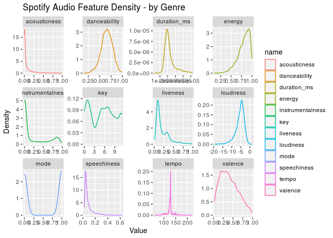
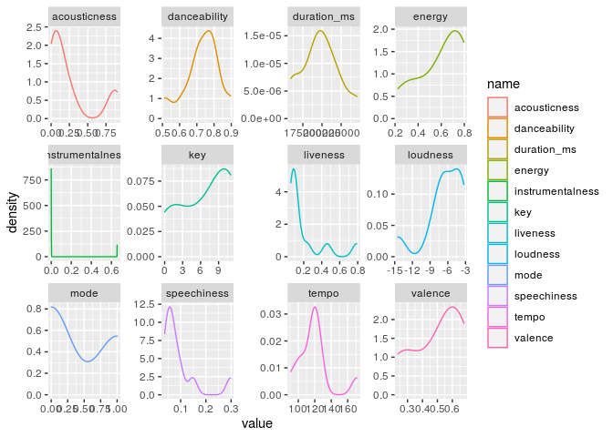
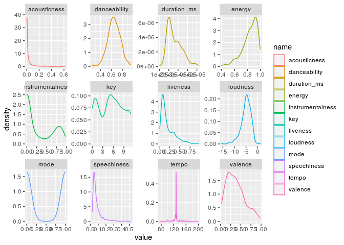
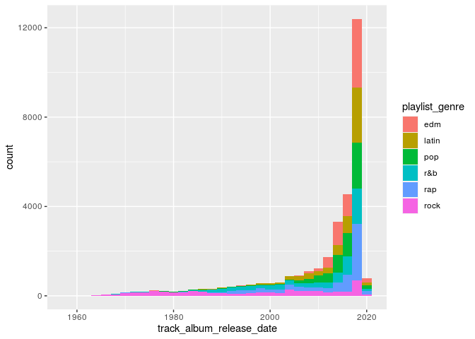
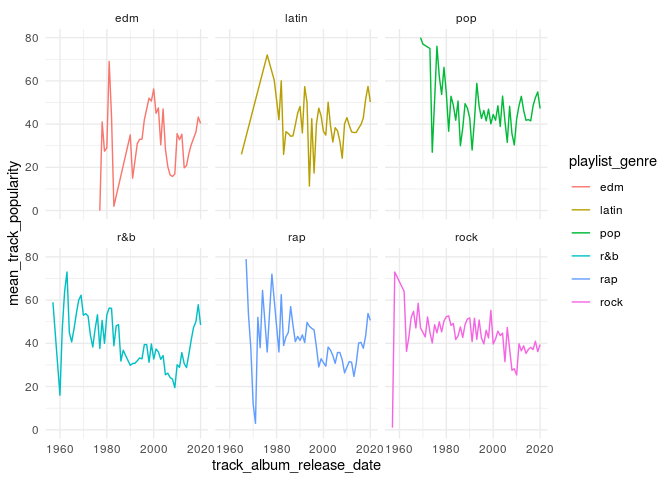

Louis’ Practice Document
================
Louis

## Setup

``` r
library(tidyverse)
library(here)

spotify_songs <- readr::read_csv(here('data/Spotify.csv'))
```

``` r
edm_songs <- spotify_songs %>%
  filter(playlist_genre == "edm")

feature_names <- names(spotify_songs)[12:23]

edm_songs %>%
  summarise(min_pop = min(track_popularity), iqr_pop = IQR(track_popularity), 
  med_pop = median(track_popularity), max_pop = max(track_popularity), 
  quantile(track_popularity))
```

    ## # A tibble: 5 x 5
    ##   min_pop iqr_pop med_pop max_pop `quantile(track_popularity)`
    ##     <dbl>   <dbl>   <dbl>   <dbl>                        <dbl>
    ## 1       0      34      36      99                            0
    ## 2       0      34      36      99                           17
    ## 3       0      34      36      99                           36
    ## 4       0      34      36      99                           51
    ## 5       0      34      36      99                           99

``` r
edm_quartiles = quantile(edm_songs$track_popularity)[2:5]
```

## Including Code

``` r
edm_songs%>%
  select(c('playlist_genre', all_of(feature_names),track_popularity)) %>%
  #filter(track_popularity > 75) %>%
  pivot_longer(cols = feature_names) %>%
  group_by(name)%>%
  ggplot(aes(x = value, colour = name)) +
  geom_density(alpha = 0.5) +
  facet_wrap(~name, scales = "free") +
  labs(title = 'Spotify Audio Feature Density - by Genre',
       x = 'Value', y = 'Density')
```

    ## Note: Using an external vector in selections is ambiguous.
    ## ℹ Use `all_of(feature_names)` instead of `feature_names` to silence this message.
    ## ℹ See <https://tidyselect.r-lib.org/reference/faq-external-vector.html>.
    ## This message is displayed once per session.

<!-- -->

``` r
edm_songs%>%
  select(feature_names,track_popularity,track_name) %>%
  slice_max(track_popularity, n = 10) %>%
  pivot_longer(cols = feature_names) %>%
  group_by(name)%>%
  ggplot(aes(x = value, colour = name)) +
  geom_density(alpha = 0.5) +
  facet_wrap(~name, scales = "free")
```

<!-- -->

``` r
edm_songs%>%
  select(feature_names,track_popularity,track_name) %>%
  slice_min(track_popularity, n = 10) %>%
  pivot_longer(cols = feature_names) %>%
  group_by(name)%>%
  ggplot(aes(x = value, colour = name)) +
  geom_density(alpha = 0.5) +
  facet_wrap(~name, scales = "free")
```

<!-- -->

``` r
spotify_songs %>%
  mutate(track_album_release_date = as.integer(str_sub(track_album_release_date, end = 4))) %>%
  ggplot(aes(x = track_album_release_date, fill = playlist_genre)) +
  geom_histogram(binwidth = 2)
```

<!-- -->

``` r
spotify_songs %>%
  mutate(track_album_release_date = as.integer(str_sub(track_album_release_date, end = 4))) %>%
  group_by(playlist_genre, track_album_release_date) %>%
  summarise(mean_track_popularity =mean(track_popularity)) %>%
  ggplot(aes(x = track_album_release_date, y = mean_track_popularity, colour = playlist_genre)) +
  geom_line() +
  theme_minimal() +
  facet_wrap(~playlist_genre)
```

    ## `summarise()` regrouping output by 'playlist_genre' (override with `.groups` argument)

<!-- -->

\#quick analysis

The top 10 seem to have much smoother graphs, meaning more variation

## Plan a strategy

I want to create a way of expressing songs based on their
characteristics, I believe it’s called a radar chart

<!-- -->

Note that the `echo = FALSE` parameter was added to the code chunk to
prevent printing of the R code that generated the plot.

``` r
clean_songs <- spotify_songs %>%
  filter(duplicated(track_name) == FALSE)
```
