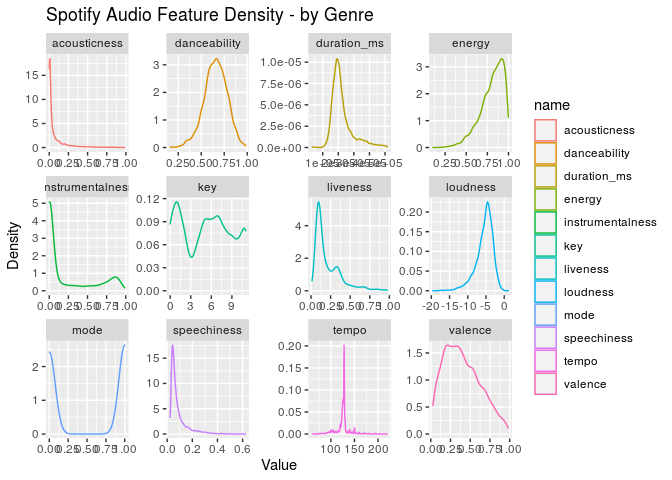
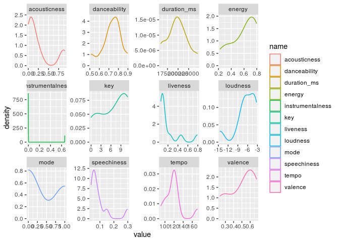
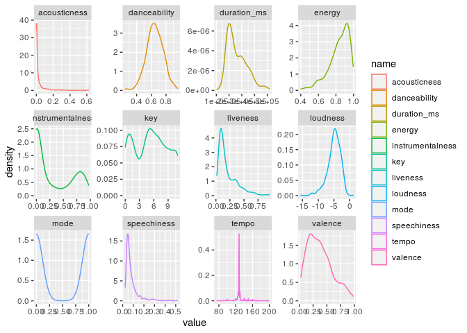
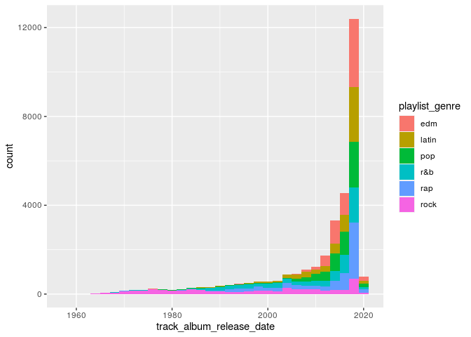
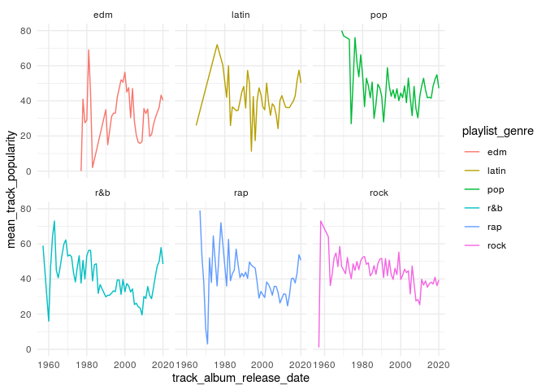
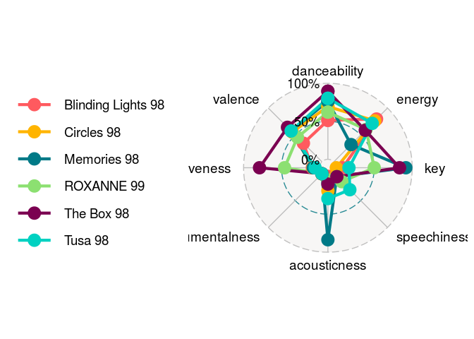
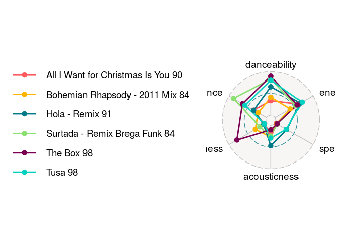
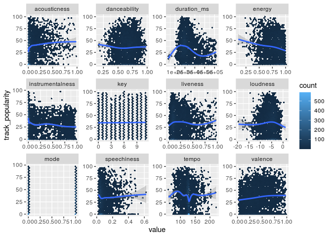

Louis’ Practice Document
================
Louis

## Setup

``` r
devtools::install_github("ricardo-bion/ggradar", 
                          dependencies = TRUE)
```

``` r
library(tidyverse)
library(here)
library(ggridges)
library(ggradar)
library(hexbin)
spotify_songs <- readr::read_csv(here('data/Spotify.csv'))
```

``` r
edm_songs <- spotify_songs %>%
  filter(playlist_genre == "edm")

feature_names <- names(spotify_songs)[12:23]
```

``` r
clean_songs <- spotify_songs %>%
  filter(duplicated(track_name) == FALSE)
```

## Including Code

``` r
edm_songs%>%
  select(c('playlist_genre', all_of(feature_names),track_popularity)) %>%
  #filter(track_popularity > 75) %>%
  pivot_longer(cols = feature_names) %>%
  group_by(name)%>%
  ggplot(aes(x = value, colour = name)) +
  geom_density(alpha = 0.5) +
  facet_wrap(~name, scales = "free") +
  labs(title = 'Spotify Audio Feature Density - by Genre',
       x = 'Value', y = 'Density')
```

    ## Note: Using an external vector in selections is ambiguous.
    ## ℹ Use `all_of(feature_names)` instead of `feature_names` to silence this message.
    ## ℹ See <https://tidyselect.r-lib.org/reference/faq-external-vector.html>.
    ## This message is displayed once per session.

<!-- -->

``` r
edm_songs%>%
  select(feature_names,track_popularity,track_name) %>%
  slice_max(track_popularity, n = 10) %>%
  pivot_longer(cols = feature_names) %>%
  group_by(name)%>%
  ggplot(aes(x = value, colour = name)) +
  geom_density(alpha = 0.5) +
  facet_wrap(~name, scales = "free")
```

<!-- -->

``` r
edm_songs%>%
  select(feature_names,track_popularity,track_name) %>%
  slice_min(track_popularity, n = 10) %>%
  pivot_longer(cols = feature_names) %>%
  group_by(name)%>%
  ggplot(aes(x = value, colour = name)) +
  geom_density(alpha = 0.5) +
  facet_wrap(~name, scales = "free")
```

<!-- -->

``` r
spotify_songs %>%
  mutate(track_album_release_date = as.integer(str_sub(track_album_release_date, end = 4))) %>%
  ggplot(aes(x = track_album_release_date, fill = playlist_genre)) +
  geom_histogram(binwidth = 2)
```

<!-- -->

``` r
spotify_songs %>%
  mutate(track_album_release_date = as.integer(str_sub(track_album_release_date, end = 4))) %>%
  group_by(playlist_genre, track_album_release_date) %>%
  summarise(mean_track_popularity =mean(track_popularity)) %>%
  ggplot(aes(x = track_album_release_date, y = mean_track_popularity, colour = playlist_genre)) +
  geom_line() +
  theme_minimal() +
  facet_wrap(~playlist_genre)
```

    ## `summarise()` regrouping output by 'playlist_genre' (override with `.groups` argument)

<!-- -->

\#quick analysis

The top 10 seem to have much smoother graphs, meaning more variation

## Plan a strategy

I want to create a way of expressing songs based on their
characteristics, I believe it’s called a radar chart

<!-- -->

``` r
clean_songs %>%
  group_by(playlist_genre) %>%
  slice_max(track_popularity, n = 1) %>%
  select(playlist_genre, track_name, playlist_name, track_popularity, feature_names) %>%
  slice_head() %>%
  group_by(track_name) %>%
  mutate(track_name = str_c(track_name,' ',toString(track_popularity))) %>%
  select(track_name, danceability, energy, speechiness, acousticness,
         liveness, valence) %>%
  ggradar(group.point.size = 3, group.line.width = 1, plot.extent.x.sf = 0.8, values.radar = NA)
```

    ## Warning: Removed 1 rows containing missing values (geom_text).
    
    ## Warning: Removed 1 rows containing missing values (geom_text).
    
    ## Warning: Removed 1 rows containing missing values (geom_text).

<!-- -->

``` r
edm_songs%>%
  select(c(all_of(feature_names),track_popularity)) %>%
  pivot_longer(cols = all_of(feature_names)) %>%
  group_by(name)%>%
  ggplot(aes(x = value, y = track_popularity)) +
  geom_hex() +
  geom_smooth() +
  facet_wrap(~name, scales = "free")
```

    ## `geom_smooth()` using method = 'gam' and formula 'y ~ s(x, bs = "cs")'

    ## Warning: Computation failed in `stat_smooth()`:
    ## x has insufficient unique values to support 10 knots: reduce k.

<!-- -->
