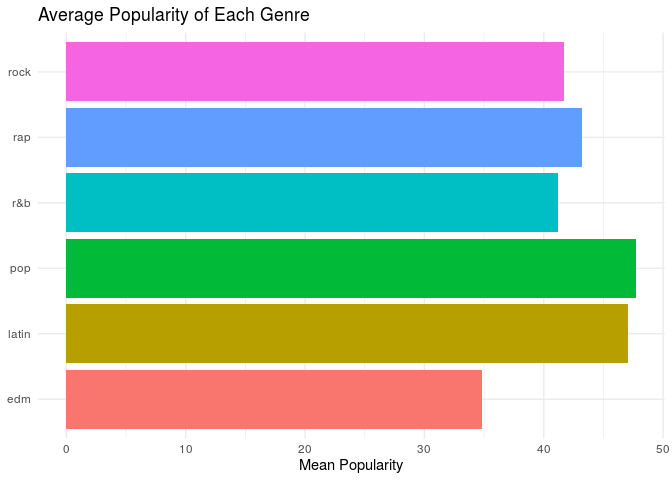

Project proposal
================
Louhavidandros

``` r
library(tidyverse)
library(broom)
```

## 1\. Introduction

We have decided that for our project, it would be interesting to try and
find what makes a song popular in its genre. For this, we will use
spotify\_songs which gets its data from the spotifyr package which in
turn gets its data from spotify.

## 2\. Data

``` r
spotify_songs <- readr::read_csv('https://raw.githubusercontent.com/rfordatascience/tidytuesday/master/data/2020/2020-01-21/spotify_songs.csv')
```

    ## Parsed with column specification:
    ## cols(
    ##   .default = col_double(),
    ##   track_id = col_character(),
    ##   track_name = col_character(),
    ##   track_artist = col_character(),
    ##   track_album_id = col_character(),
    ##   track_album_name = col_character(),
    ##   track_album_release_date = col_character(),
    ##   playlist_name = col_character(),
    ##   playlist_id = col_character(),
    ##   playlist_genre = col_character(),
    ##   playlist_subgenre = col_character()
    ## )

    ## See spec(...) for full column specifications.

## 3\. Data analysis plan

Since the aim of the project is to examine what aspects make a song
popular the response variable will always be the popularity of a song
(track\_popularity). Each genre of music will be studied separately,
using all the numeric variables as well as the artist of each song. The
comparison groups are the genres of music.

``` r
spotify_songs %>%
  count(playlist_genre)
```

    ## # A tibble: 6 x 2
    ##   playlist_genre     n
    ##   <chr>          <int>
    ## 1 edm             6043
    ## 2 latin           5155
    ## 3 pop             5507
    ## 4 r&b             5431
    ## 5 rap             5746
    ## 6 rock            4951

``` r
spotify_songs %>%
  group_by(playlist_genre) %>%
  summarise(min_pop = min(track_popularity), mean_pop = mean(track_popularity), max_pop = max(track_popularity)) %>%
  ggplot(aes(x = mean_pop, y = playlist_genre, fill = playlist_genre)) + 
  geom_col() + theme_minimal() + 
  labs(title = "Average Popularity of Each Genre", x = "Mean Popularity", y = NULL) +
  guides(fill = FALSE)
```

    ## `summarise()` ungrouping output (override with `.groups` argument)

<!-- -->

From the plot we can see that on average, pop music is the most popular
and Latin music is close behind (possibly from large quantities of
listeners from Spanish-speaking countries). Electronic Dance Music is
the least popular on average.
