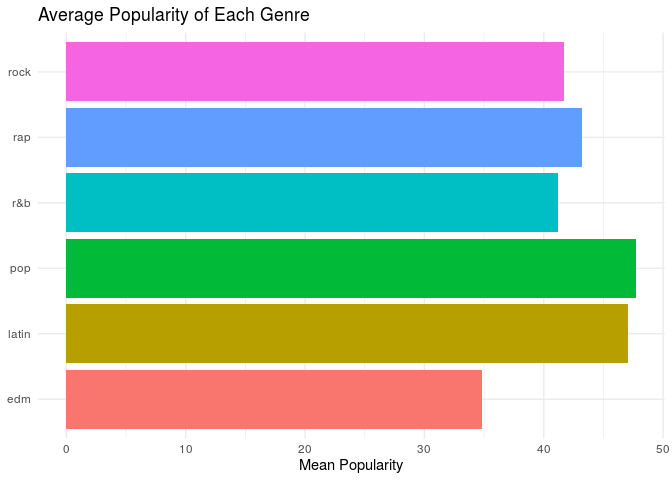

Project proposal
================
Louhavidandros

``` r
library(tidyverse)
```

## 1\. Introduction

We have decided that for our project, it would be interesting to try and
find what makes a song popular in its genre. We hypothesize that the
characteristics that make a song popular change in each genre.

For this, we will use `spotify_songs` which gets its data from the
`spotifyr` package which in turn gets its data from spotify. In this
data set the cases are songs and the variables include the `track_name`,
the `track_album_name`, the `track_artist`, the `paylist_name` it was
taken from, the `playlist_genre` and `playlist_subgenre`, the
`track_album_release_date`, the `track_popularity` and a selection of
variables calculated by spotify to represent an aspect of a song such as
its `energy` or `tempo`, as well as more general information like the
song’s `key`.

The songs are from the top 20 playlists from the top 4 sub-genres from
the top 6 genres. This means that the genre used is based on the
playlist the song was found in, not the genre of the track itself. This
means that we will have to take our results with “a pinch of salt” since
the playlist genre may not be identical to the track genre.

## 2\. Data

``` r
spotify_songs <- read_csv('data/Spotify.csv')
```

    ## Parsed with column specification:
    ## cols(
    ##   .default = col_double(),
    ##   track_id = col_character(),
    ##   track_name = col_character(),
    ##   track_artist = col_character(),
    ##   track_album_id = col_character(),
    ##   track_album_name = col_character(),
    ##   track_album_release_date = col_character(),
    ##   playlist_name = col_character(),
    ##   playlist_id = col_character(),
    ##   playlist_genre = col_character(),
    ##   playlist_subgenre = col_character()
    ## )

    ## See spec(...) for full column specifications.

``` r
glimpse(spotify_songs)
```

    ## Rows: 32,833
    ## Columns: 23
    ## $ track_id                 <chr> "6f807x0ima9a1j3VPbc7VN", "0r7CVbZTWZgbTCYdf…
    ## $ track_name               <chr> "I Don't Care (with Justin Bieber) - Loud Lu…
    ## $ track_artist             <chr> "Ed Sheeran", "Maroon 5", "Zara Larsson", "T…
    ## $ track_popularity         <dbl> 66, 67, 70, 60, 69, 67, 62, 69, 68, 67, 58, …
    ## $ track_album_id           <chr> "2oCs0DGTsRO98Gh5ZSl2Cx", "63rPSO264uRjW1X5E…
    ## $ track_album_name         <chr> "I Don't Care (with Justin Bieber) [Loud Lux…
    ## $ track_album_release_date <chr> "2019-06-14", "2019-12-13", "2019-07-05", "2…
    ## $ playlist_name            <chr> "Pop Remix", "Pop Remix", "Pop Remix", "Pop …
    ## $ playlist_id              <chr> "37i9dQZF1DXcZDD7cfEKhW", "37i9dQZF1DXcZDD7c…
    ## $ playlist_genre           <chr> "pop", "pop", "pop", "pop", "pop", "pop", "p…
    ## $ playlist_subgenre        <chr> "dance pop", "dance pop", "dance pop", "danc…
    ## $ danceability             <dbl> 0.748, 0.726, 0.675, 0.718, 0.650, 0.675, 0.…
    ## $ energy                   <dbl> 0.916, 0.815, 0.931, 0.930, 0.833, 0.919, 0.…
    ## $ key                      <dbl> 6, 11, 1, 7, 1, 8, 5, 4, 8, 2, 6, 8, 1, 5, 5…
    ## $ loudness                 <dbl> -2.634, -4.969, -3.432, -3.778, -4.672, -5.3…
    ## $ mode                     <dbl> 1, 1, 0, 1, 1, 1, 0, 0, 1, 1, 1, 1, 1, 0, 0,…
    ## $ speechiness              <dbl> 0.0583, 0.0373, 0.0742, 0.1020, 0.0359, 0.12…
    ## $ acousticness             <dbl> 0.10200, 0.07240, 0.07940, 0.02870, 0.08030,…
    ## $ instrumentalness         <dbl> 0.00e+00, 4.21e-03, 2.33e-05, 9.43e-06, 0.00…
    ## $ liveness                 <dbl> 0.0653, 0.3570, 0.1100, 0.2040, 0.0833, 0.14…
    ## $ valence                  <dbl> 0.518, 0.693, 0.613, 0.277, 0.725, 0.585, 0.…
    ## $ tempo                    <dbl> 122.036, 99.972, 124.008, 121.956, 123.976, …
    ## $ duration_ms              <dbl> 194754, 162600, 176616, 169093, 189052, 1630…

## 3\. Data analysis plan

Since the aim of the project is to examine what aspects make a song
popular the response variable will always be the popularity of a song
(`track_popularity`). Each genre of music will be studied separately,
using all the numeric variables as well as the artist of each song. The
comparison groups are the genres of music.

``` r
spotify_songs %>%
  count(playlist_genre)
```

    ## # A tibble: 6 x 2
    ##   playlist_genre     n
    ##   <chr>          <int>
    ## 1 edm             6043
    ## 2 latin           5155
    ## 3 pop             5507
    ## 4 r&b             5431
    ## 5 rap             5746
    ## 6 rock            4951

``` r
spotify_songs %>%
  group_by(playlist_genre) %>%
  summarise(min_pop = min(track_popularity), mean_pop = mean(track_popularity), max_pop = max(track_popularity)) %>%
  ggplot(aes(x = mean_pop, y = playlist_genre, fill = playlist_genre)) + 
  geom_col() + theme_minimal() + 
  labs(title = "Average Popularity of Each Genre", x = "Mean Popularity", y = NULL) +
  guides(fill = FALSE)
```

    ## `summarise()` ungrouping output (override with `.groups` argument)

<!-- -->

From the plot we can see that on average, pop music is the most popular
and Latin music is close behind (possibly from large quantities of
listeners from Spanish-speaking countries). Electronic Dance Music is
the least popular on average.

The goal of our project is to examine what makes a song popular and
whether it changes in each genre. Therefore, we will examine the
different variables and how they affect popularity in each genre,
comparing the genres against one another to find differences. The
statistical methods we aim to use will be multiple forms of graphs,
mainly scatter and bar plots. The graphs will involve the popularity of
a song compared to the characteristics, mentioned in the introduction.

We have a lot of numerical data to use so we will aim to get as much
useful data onto our graphs as possible. We may also use histograms for
some specific cases such as grouping songs by length. We also plan on
using `summarize()` to show condensed data while making comparisons
between variables. One specific idea we have is grouping songs by `mode`
(whether the song is in a major or minor key) and calculating their mean
popularity to observe any difference. Lastly, radar graphs might be used
to examine and compare the average characteristics of each genre.

If the results were to support our hypothesis, we would expect different
characteristics making a song popular in each genre. For example, the
radar graphs would take on noticeably different shapes.
